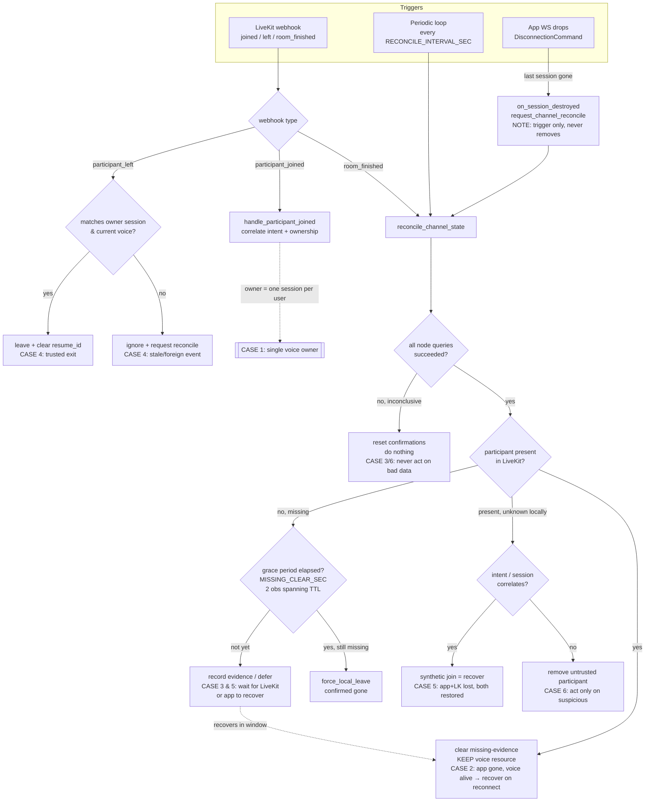

```mermaid
flowchart TD
    subgraph TRIG[Triggers]
        A1[App WS drops<br/>DisconnectionCommand]
        A2[LiveKit webhook<br/>joined / left / room_finished]
        A3[Periodic loop<br/>every RECONCILE_INTERVAL_SEC]
    end

    A1 -->|last session gone| OSD[on_session_destroyed<br/>request_channel_reconcile<br/>NOTE: trigger only, never removes]
    OSD --> RC
    A3 --> RC[reconcile_channel_state]
    A2 --> WH{webhook type}

    %% Authoritative webhook path = Case 4
    WH -->|participant_joined| WJ[handle_participant_joined<br/>correlate intent + ownership]
    WH -->|participant_left| WL{matches owner session<br/>& current voice?}
    WH -->|room_finished| RC
    WL -->|yes| LV[leave + clear resume_id<br/>CASE 4: trusted exit]
    WL -->|no| IGN[ignore + request reconcile<br/>CASE 4: stale/foreign event]
    WJ -.->|owner = one session per user| C1[[CASE 1: single voice owner]]

    %% Reconcile path
    RC --> Q{all node queries<br/>succeeded?}
    Q -->|no, inconclusive| NOP[reset confirmations<br/>do nothing<br/>CASE 3/6: never act on bad data]
    Q -->|yes| P{participant present<br/>in LiveKit?}

    P -->|yes| KEEP[clear missing-evidence<br/>KEEP voice resource<br/>CASE 2: app gone, voice alive → recover on reconnect]
    P -->|no, missing| G{grace period elapsed?<br/>MISSING_CLEAR_SEC<br/>2 obs spanning TTL}

    G -->|not yet| DEFER[record evidence / defer<br/>CASE 3 & 5: wait for LiveKit<br/>or app to recover]
    DEFER -.->|recovers in window| KEEP
    G -->|yes, still missing| LEAVE[force_local_leave<br/>confirmed gone]

    %% Remote-present-but-not-local = recovery / anti-abuse
    P -->|present, unknown locally| COR{intent / session<br/>correlates?}
    COR -->|yes| REJOIN[synthetic join = recover<br/>CASE 5: app+LK lost, both restored]
    COR -->|no| KICK[remove untrusted participant<br/>CASE 6: act only on suspicious]
```