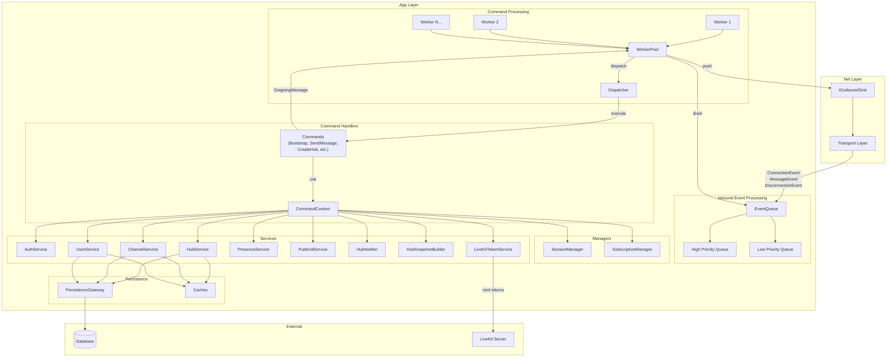
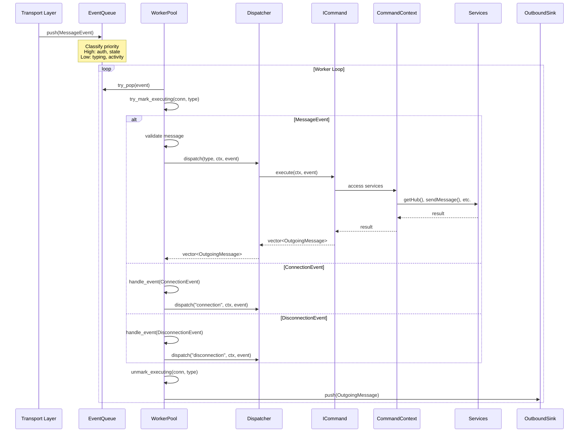
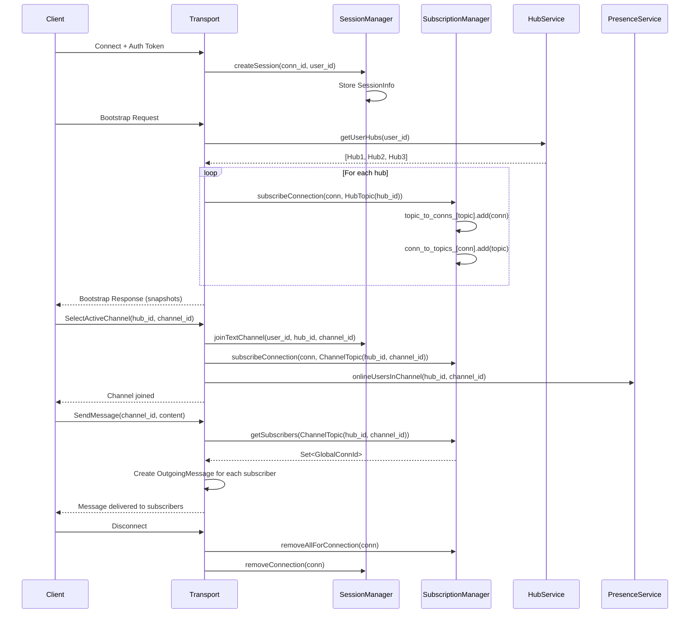
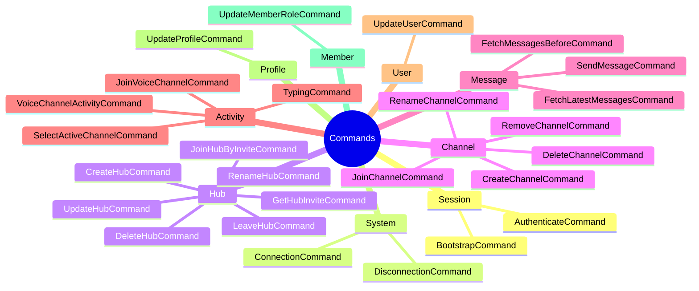

# App Layer Architecture

## Overview Diagram

```mermaid
classDiagram
    direction TB

    %% ============================================
    %% APPSTACK (Top Level Orchestrator)
    %% ============================================
    class AppStack {
        -ServerConfig config_
        -IOutboundSink* out_queue_
        -unique_ptr~PersistenceGateway~ persistence_gateway_
        -unique_ptr~SubscriptionManager~ subscription_manager_
        -unique_ptr~SessionManager~ session_manager_
        -unique_ptr~AuthService~ auth_service_
        -unique_ptr~PublicIdService~ public_id_service_
        -unique_ptr~PresenceService~ presence_manager_
        -unique_ptr~UserService~ user_service_
        -unique_ptr~ChannelService~ channel_service_
        -unique_ptr~HubService~ hub_service_
        -unique_ptr~HubNotifier~ hub_notifier_
        -unique_ptr~HubSnapshotBuilder~ hub_snapshot_builder_
        -unique_ptr~LiveKitTokenService~ livekit_token_service_
        -unique_ptr~CommandContext~ cmd_ctx_
        -unique_ptr~EventQueue~ event_queue_
        -unique_ptr~Dispatcher~ dispatcher_
        -unique_ptr~WorkerPool~ worker_pool_
        +start() void
        +stop() void
        +pause() void
        +resume() void
        +bootstrap() void
        +event_sink() IEventSink&
        +attach_outbound_sink(IOutboundSink& sink) void
        -init_database() void
        -init_managers() void
        -init_services() void
        -init_dispatcher() void
        -init_workers() void
    }

    %% ============================================
    %% EVENT QUEUE (Inbound)
    %% ============================================
    class EventPriority {
        <<enumeration>>
        High = 0
        Low = 1
    }
    
    class PushResult {
        <<enumeration>>
        Ok
        DroppedLow
        DroppedHigh
    }

    class Payload {
        +Envelope env
        +ParsedPayload parsed
    }

    class ConnectionEvent {
        +GlobalConnId conn_id
        +UserId user_id
    }

    class DisconnectionEvent {
        +GlobalConnId conn_id
        +int code
        +string reason
    }

    class MessageEvent {
        +GlobalConnId conn_id
        +Payload payload
    }

    class IEventSink {
        <<interface>>
        +push(Event& event)* PushResult
        +push(Event&& event)* PushResult
    }

    class EventQueue {
        -mutex mu_
        -deque~Event~ high_
        -deque~Event~ low_
        -size_t capacity_ = 30000
        -size_t size_
        +push(Event& event) PushResult
        +push(Event&& event) PushResult
        +try_pop(Event& out) bool
        +size() size_t
        +stop() void
        -push_impl(Event&&) PushResult
        -record_drop_low_overflow() void
        -record_drop_high_overflow() void
        -record_evict_low_for_high() void
    }

    EventQueue ..|> IEventSink : implements
    MessageEvent *-- Payload

    %% ============================================
    %% COMMAND CONTEXT & DISPATCHER
    %% ============================================
    class CommandContext {
        +PublicIdService& ids
        +AuthService& auth_service
        +ChannelService& channel_service
        +HubService& hub_service
        +HubNotifier& hub_notifier
        +HubSnapshotBuilder& hub_snapshot_builder
        +LiveKitTokenService& livekit_token_service
        +UserService& user_service
        +PresenceService& presence_manager
        +SubscriptionManager& subscription_manager
        +SessionManager& session_manager
    }

    class ICommand {
        <<interface>>
        +execute(CommandContext& ctx, Event& evt)* vector~OutgoingMessage~
    }

    class Dispatcher {
        -unordered_map~Envelope_Type, unique_ptr~ICommand~~ map_proto_
        -unordered_map~string, unique_ptr~ICommand~~ map_str_
        +dispatch(string& type, CommandContext& ctx, Event& evt) vector~OutgoingMessage~
        +dispatch(Envelope_Type type, CommandContext& ctx, Event& evt) vector~OutgoingMessage~
        +registered_commands() unordered_set~string~
        +register_all() void
    }

    Dispatcher "1" *-- "*" ICommand : contains

    %% ============================================
    %% WORKER POOL
    %% ============================================
    class WorkerPool {
        -EventQueue& in_queue_
        -IOutboundSink& out_queue_
        -Dispatcher& dispatcher_
        -CommandContext& cmd_ctx_
        -MessageValidator message_validator_
        -ProtoMessageValidator proto_validator_
        -AppStackConfig config_
        -atomic_bool running_
        -atomic_bool paused_
        -vector~jthread~ workers_
        -unordered_map~GlobalConnId, unordered_set~Type~~ executing_commands_
        -mutex executing_commands_mtx_
        -mutex pause_mtx_
        -condition_variable pause_cv_
        +start() void
        +stop() void
        +pause() void
        +resume() void
        +is_paused() bool
        +is_running() bool
        -try_mark_executing(GlobalConnId, Type) bool
        -unmark_executing(GlobalConnId, Type) void
        -worker_loop(size_t worker_index) void
        -wait_if_paused() void
        -prepare_error_msg(...) string
        -handle_event(MessageEvent&) vector~OutgoingMessage~
        -handle_event(ConnectionEvent&) vector~OutgoingMessage~
        -handle_event(DisconnectionEvent&) vector~OutgoingMessage~
    }

    WorkerPool --> EventQueue : drains
    WorkerPool --> Dispatcher : dispatches to
    WorkerPool --> CommandContext : passes to commands

    %% ============================================
    %% MANAGERS
    %% ============================================
    class SessionInfo {
        +unordered_set~HubId~ snapshotted_hubs
        +optional~HubId~ current_hub
        +optional~ChannelId~ current_text_channel
        +optional~HubId~ current_voice_hub
        +optional~ChannelId~ current_voice_channel
        +bool voice_muted = false
        +bool voice_deafened = false
        +optional~GlobalConnId~ main_conn
    }

    class SessionManager {
        -shared_mutex mutex_
        -unordered_map~UserId, SessionInfo~ sessions_
        -unordered_map~GlobalConnId, UserId~ conn_to_session_
        +createSession(GlobalConnId&, UserId&) void
        +tryCreateSession(GlobalConnId&, UserId&) bool
        +removeConnection(GlobalConnId&) void
        +joinTextChannel(UserId&, HubId&, ChannelId&) void
        +leaveTextChannel(UserId&) void
        +joinVoiceChannel(UserId&, HubId&, ChannelId&) void
        +leaveVoiceChannel(UserId&) void
        +setVoiceMuted(UserId&, bool) bool
        +setVoiceDeafened(UserId&, bool) bool
        +voiceParticipantsInChannel(HubId&, ChannelId&) vector~UserId~
        +hasSession(UserId&) bool
        +sessionOfConnection(GlobalConnId&) expected~UserId, SessionError~
        +getSession(UserId&) expected~SessionInfo, SessionError~
        +getMainConnection(UserId&) expected~GlobalConnId, SessionError~
        +activeUsers() vector~UserId~
    }

    SessionManager "1" *-- "*" SessionInfo : stores

    class TopicKind {
        <<enumeration>>
        Hub = 0
        Channel
        User
    }

    class Topic {
        +TopicKind kind
        +string topic_id
        +HubTopic(HubId&)$ Topic
        +ChannelTopic(HubId&, ChannelId&)$ Topic
        +UserTopic(UserId&)$ Topic
    }

    class ISubscriptionManager {
        <<interface>>
        +subscribeConnection(GlobalConnId&, Topic&)* bool
        +unsubscribeConnection(GlobalConnId&, Topic&)* bool
        +isSubscribed(GlobalConnId&, Topic&)* bool
        +getSubscribers(Topic&)* shared_ptr~const unordered_set~GlobalConnId~~
        +getSubscriptionsForConnection(GlobalConnId&)* expected~unordered_set~Topic~, Error~
        +removeAllForConnection(GlobalConnId&)* void
        +removeAllForTopic(Topic&)* void
    }

    class SubscriptionManager {
        -unordered_map~Topic, SubscriberSetPtr~ topic_to_conns_
        -unordered_map~GlobalConnId, unordered_set~Topic~~ conn_to_topics_
        -shared_mutex mu_
        +subscribeConnection(GlobalConnId&, Topic&) bool
        +unsubscribeConnection(GlobalConnId&, Topic&) bool
        +isSubscribed(GlobalConnId&, Topic&) bool
        +getSubscribers(Topic&) shared_ptr~const unordered_set~GlobalConnId~~
        +getSubscriptionsForConnection(GlobalConnId&) expected~unordered_set~Topic~, Error~
        +removeAllForConnection(GlobalConnId&) void
        +removeAllForTopic(Topic&) void
    }

    SubscriptionManager ..|> ISubscriptionManager : implements
    Topic *-- TopicKind

    %% ============================================
    %% SERVICES
    %% ============================================
    class AuthError {
        <<enumeration>>
        InvalidToken
        ExpiredToken
        Other
    }

    class AuthService {
        -SupabaseVerifier token_verifier_
        +authenticate(string_view token) AuthResult
    }

    class PublicIdService {
        -shared_mutex mutex_
        -ForwardMap hub_forward_
        -ReverseMap hub_reverse_
        -ForwardMap channel_forward_
        -ReverseMap channel_reverse_
        -ForwardMap user_forward_
        -ReverseMap user_reverse_
        -ForwardMap message_forward_
        -ReverseMap message_reverse_
        -unordered_set~uint64_t~ issued_tokens_
        -mt19937_64 rng_
        +to_public(HubId&) PublicHubId
        +to_public(ChannelId&) PublicChannelId
        +to_public(UserId&) PublicUserId
        +to_public(MessageId&) PublicMessageId
        +to_internal(PublicHubId&) optional~HubId~
        +to_internal(PublicChannelId&) optional~ChannelId~
        +to_internal(PublicUserId&) optional~UserId~
        +to_internal(PublicMessageId&) optional~MessageId~
        -ensure_mapping(...) uint64_t
        -lookup_internal(...) optional~string~
        -generate_token() uint64_t
    }

    class PresenceService {
        -SessionManager& sessions_
        -SubscriptionManager& subs_
        +onlineUsers() vector~UserId~
        +onlineUsersInHub(HubId&) vector~UserId~
        +onlineUsersInChannel(HubId&, ChannelId&) vector~UserId~
        +isUserOnline(UserId&) bool
    }

    class UserService {
        -UserRepository& repo_
        -unique_ptr~IUserCache~ cache_
        +getUser(UserId&) optional~User~
        +getDisplayName(UserId&) optional~string~
        +updateProfile(UserId&, optional~string~, optional~string~) expected~void, UpdateError~
        +updateSettings(UserId&, optional~string~, optional~string~) expected~void, UpdateError~
    }

    class HubMemberSummary {
        +UserId user_id
        +string display_name
        +string avatar_seed
    }

    class HubService {
        -HubRepository& repo_
        -ChannelRepository& channel_repo_
        -unique_ptr~IHubCache~ cache_
        -shared_mutex snapshot_mutex_
        -unordered_map~HubId, HubSnapshot~ snapshots_
        +getHub(HubId&) optional~Hub~
        +getUserHubs(UserId&) vector~Hub~
        +getHubMembers(HubId&) vector~HubMemberSummary~
        +isHubMember(HubId&, UserId&) bool
        +getMembershipRole(HubId&, UserId&) optional~Role~
        +createHub(string&, UserId&) HubId
        +renameHub(HubId&, string&) bool
        +updateHubAvatarSeed(HubId&, string&) bool
        +deleteHub(HubId&, UserId&) bool
        +addMember(HubId&, UserId&, Role) void
        +removeMember(HubId&, UserId&) void
        +buildSnapshot(HubId&) HubSnapshot
        +tryGetSnapshot(HubId&) optional~HubSnapshot~
        +tryGetSnapshotChannel(ChannelId&) optional~pair~HubId, HubSnapshotChannel~~
        +getOrBuildSnapshot(HubId&) HubSnapshot
        +invalidateSnapshot(HubId&) void
        +invalidateSnapshotsForChannel(ChannelId&) void
    }

    class ChannelService {
        -ChannelRepository& repo_
        -unique_ptr~IChannelCache~ cache_
        -HubService* hub_service_
        +setHubService(HubService&) void
        +getChannel(ChannelId&) optional~Channel~
        +getHubChannels(HubId&) vector~Channel~
        +createChannel(HubId&, string&, string&) ChannelId
        +renameChannel(ChannelId&, string&) bool
        +deleteChannel(ChannelId&, HubId&) bool
        +fetchMessages(ChannelId&, int) expected~vector~Message~, MessageError~
        +fetchMessagesAfter(ChannelId&, MessageId&, int) expected~vector~Message~, MessageError~
        +fetchMessagesBefore(ChannelId&, MessageId&, int) expected~vector~Message~, MessageError~
        +sendMessage(ChannelId&, UserId&, string&) expected~Message, MessageError~
    }

    class HubNotifier {
        -PublicIdService& ids_
        +hubRenamed(HubId&, string&) string
        +hubDeleted(HubId&) string
        +memberJoined(HubId&, UserId&, Role, ...) string
        +memberLeft(HubId&, UserId&) string
        +memberOnline(HubId&, UserId&) string
        +memberOffline(HubId&, UserId&) string
        +channelCreated(HubId&, Channel&) string
        +channelRenamed(HubId&, Channel&) string
        +channelDeleted(HubId&, ChannelId&) string
    }

    class HubSnapshotBuilder {
        -ChannelService& channel_servise_
        -HubService& hub_service_
        -PresenceService& presence_
        -PublicIdService& ids_
        +build(HubId&) json
        -build_channels(HubId&) json
        -build_members(HubId&) json
    }

    class TokenRequest {
        +UserId identity
        +ChannelId room
        +bool can_publish
        +bool can_subscribe
        +seconds ttl
    }

    class LiveKitTokenService {
        -string api_key_
        -string api_secret_
        +mint_token(TokenRequest&) string
    }

    LiveKitTokenService *-- TokenRequest : uses

    %% ============================================
    %% COMMANDS (Examples)
    %% ============================================
    class BootstrapCommand {
        +execute(CommandContext&, Event&) vector~OutgoingMessage~
    }
    class SendMessageCommand {
        +execute(CommandContext&, Event&) vector~OutgoingMessage~
    }
    class ConnectionCommand {
        +execute(CommandContext&, Event&) vector~OutgoingMessage~
    }
    class DisconnectionCommand {
        +execute(CommandContext&, Event&) vector~OutgoingMessage~
    }
    class AuthenticateCommand {
        +execute(CommandContext&, Event&) vector~OutgoingMessage~
    }

    BootstrapCommand ..|> ICommand
    SendMessageCommand ..|> ICommand
    ConnectionCommand ..|> ICommand
    DisconnectionCommand ..|> ICommand
    AuthenticateCommand ..|> ICommand

    %% ============================================
    %% CONVERTERS
    %% ============================================
    class ProtoConverters {
        <<namespace>>
        +to_proto_channel_type(ChannelType) ProtoChannelType$
        +from_proto_channel_type(ProtoChannelType) ChannelType$
        +to_proto_hub_role(Role) ProtoHubRole$
        +from_proto_hub_role(ProtoHubRole) Role$
    }

    %% ============================================
    %% RELATIONSHIPS
    %% ============================================
    AppStack *-- EventQueue
    AppStack *-- Dispatcher
    AppStack *-- WorkerPool
    AppStack *-- CommandContext
    AppStack *-- SessionManager
    AppStack *-- SubscriptionManager
    AppStack *-- AuthService
    AppStack *-- PublicIdService
    AppStack *-- PresenceService
    AppStack *-- UserService
    AppStack *-- ChannelService
    AppStack *-- HubService
    AppStack *-- HubNotifier
    AppStack *-- HubSnapshotBuilder
    AppStack *-- LiveKitTokenService

    CommandContext --> PublicIdService
    CommandContext --> AuthService
    CommandContext --> ChannelService
    CommandContext --> HubService
    CommandContext --> HubNotifier
    CommandContext --> HubSnapshotBuilder
    CommandContext --> LiveKitTokenService
    CommandContext --> UserService
    CommandContext --> PresenceService
    CommandContext --> SubscriptionManager
    CommandContext --> SessionManager

    PresenceService --> SessionManager
    PresenceService --> SubscriptionManager
    HubSnapshotBuilder --> ChannelService
    HubSnapshotBuilder --> HubService
    HubSnapshotBuilder --> PresenceService
    HubSnapshotBuilder --> PublicIdService
    HubNotifier --> PublicIdService
    ChannelService ..> HubService : optional ref
```

## Data Flow Diagram

## Event Processing Sequence

## Session & Subscription Flow

## Command Categories

## Component Responsibilities

| Component | Namespace | Responsibility |
|-----------|-----------|----------------|
| `AppStack` | `app` | Top-level orchestrator; initializes and wires all components |
| `EventQueue` | `app::queue` | Priority queue for inbound events from transport |
| `WorkerPool` | `app::worker` | Multi-threaded event processor; prevents duplicate execution |
| `Dispatcher` | `app` | Routes events to appropriate command handlers |
| `CommandContext` | `app` | Dependency injection container for commands |
| `ICommand` | `app` | Interface for all command handlers |
| `SessionManager` | `app` | Manages active user sessions and voice state |
| `SubscriptionManager` | `app` | Pub/sub for topic-based message routing |
| `AuthService` | `app::services` | JWT token verification via Supabase |
| `PublicIdService` | `app::services` | Maps internal UUIDs to public integer IDs |
| `UserService` | `app::services` | User profile CRUD with caching |
| `HubService` | `app::services` | Hub CRUD, membership, snapshots |
| `ChannelService` | `app::services` | Channel CRUD, message operations |
| `PresenceService` | `app::services` | Real-time online status queries |
| `HubNotifier` | `app::services` | Serializes hub event notifications |
| `HubSnapshotBuilder` | `app::services` | Builds full hub state snapshots |
| `LiveKitTokenService` | `app::services::livekit` | Mints voice channel access tokens |

## Key Fields to Consider for Updates

### SessionInfo Fields
| Field | Type | Description |
|-------|------|-------------|
| `snapshotted_hubs` | `unordered_set<HubId>` | Hubs user has received snapshot for |
| `current_hub` | `optional<HubId>` | Currently active hub |
| `current_text_channel` | `optional<ChannelId>` | Currently active text channel |
| `current_voice_hub` | `optional<HubId>` | Hub of current voice channel |
| `current_voice_channel` | `optional<ChannelId>` | Currently joined voice channel |
| `voice_muted` | `bool` | Microphone muted |
| `voice_deafened` | `bool` | Audio deafened |
| `main_conn` | `optional<GlobalConnId>` | Primary transport connection |

### Topic Fields
| Field | Type | Description |
|-------|------|-------------|
| `kind` | `TopicKind` | Hub, Channel, or User |
| `topic_id` | `string` | Format: `hub:<id>` or `hub:<id>:channel:<id>` or `user:<id>` |

### EventQueue Configuration
| Field | Type | Default | Description |
|-------|------|---------|-------------|
| `capacity_` | `size_t` | 30000 | Max events in queue |
| `high_` | `deque<Event>` | - | High priority events (auth, state) |
| `low_` | `deque<Event>` | - | Low priority events (typing, activity) |

### WorkerPool Configuration (AppStackConfig)
| Field | Type | Description |
|-------|------|-------------|
| `workers_` | `vector<jthread>` | Worker threads |
| `executing_commands_` | `map<GlobalConnId, set<Type>>` | In-flight command deduplication |

### Event Priority Classification
| Event Type | Priority | Reason |
|------------|----------|--------|
| `TYPING` | Low | UI hint only |
| `PRESENCE` | Low | UI hint only |
| `VOICE_ACTIVITY` | Low | Non-authoritative |
| `VOICE_JOIN` | High | Membership truth |
| `VOICE_CHANNEL_PARTICIPANTS` | High | Membership truth |
| All others | High | State-affecting |

### PublicIdService Mappings
| Internal Type | Public Type | Format |
|---------------|-------------|--------|
| `HubId` (UUID) | `PublicHubId` (uint64) | Random token |
| `ChannelId` (UUID) | `PublicChannelId` (uint64) | Random token |
| `UserId` (UUID) | `PublicUserId` (uint64) | Random token |
| `MessageId` (UUID) | `PublicMessageId` (uint64) | Random token |

### HubService Cache & Snapshots
| Field | Type | Description |
|-------|------|-------------|
| `cache_` | `unique_ptr<IHubCache>` | LRU cache for Hub objects |
| `snapshots_` | `map<HubId, HubSnapshot>` | Full hub topology cache |
| `snapshot_mutex_` | `shared_mutex` | Protects snapshot map |
