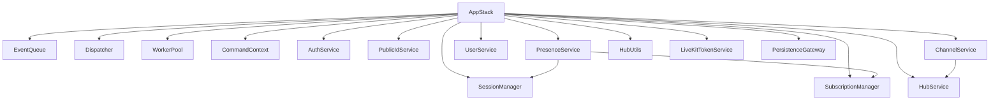

# App Layer Architecture

This document reflects the current app layer in `app/`.

## Component Graph

## Bootstrap Sequence (`app/AppStack.cpp`)

`AppStack::bootstrap()` performs:
1. `init_database()`
2. `init_managers()`
3. `init_services()`
4. `init_dispatcher()`
5. `init_workers()`

Key details:
- `EventQueue` is created in constructor with `config_.app_stack.event_queue_capacity`.
- `ChannelService` async writer starts only when `db_write_queue_capacity > 0`.
- `CommandContext` includes an `event_sink` used to enqueue follow-up events (for example bootstrap after auth).

## Dispatcher Registrations

`app/dispatcher/Dispatcher.cpp` currently registers:

String events:
- `connection` -> `BootstrapCommand`
- `disconnection` -> `DisconnectionCommand`

Envelope commands:
- `AUTH`
- `ACTIVE_CHANNEL`
- `TYPING`
- `VOICE_JOIN`
- `VOICE_ACTIVITY`
- `MESSAGE_SEND`
- `MESSAGE_FETCH_LATEST`
- `MESSAGE_FETCH_BEFORE`
- `HUB_CREATE`
- `HUB_JOIN`
- `HUB_CREATE_JOIN_CODE`
- `HUB_LEAVE`
- `HUB_REMOVE`
- `HUB_RENAME`
- `HUB_UPDATE`
- `USER_UPDATE`
- `CHANNEL_CREATE`
- `CHANNEL_RENAME`
- `CHANNEL_REMOVE`

## WorkerPool Behavior

`app/worker/WorkerPool.cpp`:
- N worker threads (`WORKER_THREADS`)
- Pops from `EventQueue`
- Validates/parses envelopes with `ProtoMessageValidator`
- Tracks in-flight `(connection, envelope_type)` to drop duplicate concurrent commands
- Dispatches via `Dispatcher`
- Pushes resulting `OutgoingMessage` intents to outbound sink

On invalid envelope parse:
- Emits `DropConnection` intent with invalid-format code.

## Event Queue Priorities

`app/queue/Msg.h` + `app/queue/EventQueue.h`:
- High priority by default
- Explicitly low priority:
- `TYPING`
- `PRESENCE`
- `VOICE_ACTIVITY`
- Explicitly high priority voice authority:
- `VOICE_JOIN`
- `VOICE_CHANNEL_PARTICIPANTS`
- `VOICE_CHANNEL_PRESENCE`

Overflow policy:
- Low can be dropped.
- High can evict low if available.

## Session and Subscription Model

`SessionManager` (`app/managers/session/SessionManager.*`):
- Session is created after auth success.
- Current implementation enforces a single active session per user.
- Tracks active text channel and active voice channel + mute/deafen flags.

`SubscriptionManager` (`app/managers/subscription/SubscriptionManager.*`):
- Connection-scoped topic subscriptions.
- Maintains `topic -> conns` and `conn -> topics` indexes.

## Auth and Bootstrap Contract

`AuthenticateCommand`:
- Validates `AUTH` payload (`SUPABASE`, token required)
- Verifies token through `AuthService`
- On success:
- emits `UpdateAuthState(AUTHED, expiry, user_id)`
- emits `AUTH_OK`
- for first auth only: enqueues `ConnectionEvent` for bootstrap

`BootstrapCommand`:
- Loads user + hubs
- Subscribes connection to hub topics
- Builds and sends `SESSION_BOOTSTRAP`
- Optionally emits low-priority presence fanout

## Messaging Contract

`SendMessageCommand`:
- Requires authenticated session
- Validates membership and active text channel
- Persists through `ChannelService`
- Fanouts `MESSAGE_CREATED` to channel subscribers

`FetchLatestMessagesCommand` and `FetchMessagesBeforeCommand`:
- Validate membership
- Return `MESSAGE_BATCH` to requesting connection only

## Voice Signaling Contract

`JoinVoiceChannelCommand` is join/switch intent only:
- validates hub/channel/session
- handles takeover/switch kick policy
- writes pending join intent
- mints token and emits `VOICE_TOKEN_ISSUED`
- authoritative join/leave mutation + fanout happens on webhook handlers

`VoiceChannelActivityCommand`:
- Handles mute/unmute/deafen/undeafen
- Broadcasts `VOICE_CHANNEL_PRESENCE` updates

## Service Inventory

Current services in `AppStack`:
- `AuthService`
- `PublicIdService`
- `PresenceService`
- `UserService`
- `ChannelService`
- `HubService`
- `HubUtils`
- `LiveKitTokenService` (token + per-channel E2EE key lifecycle)
