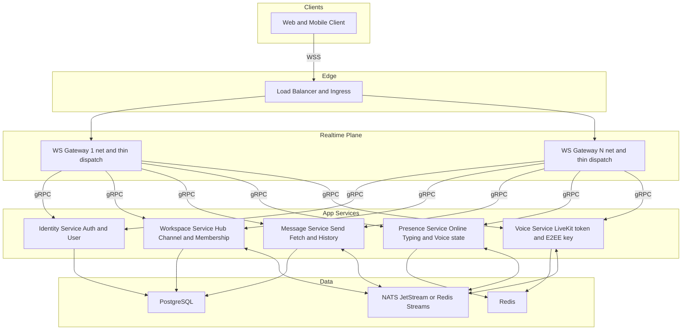
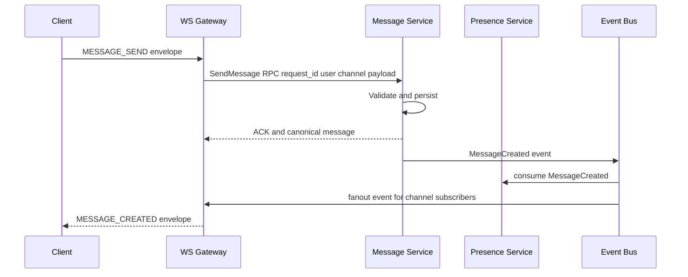
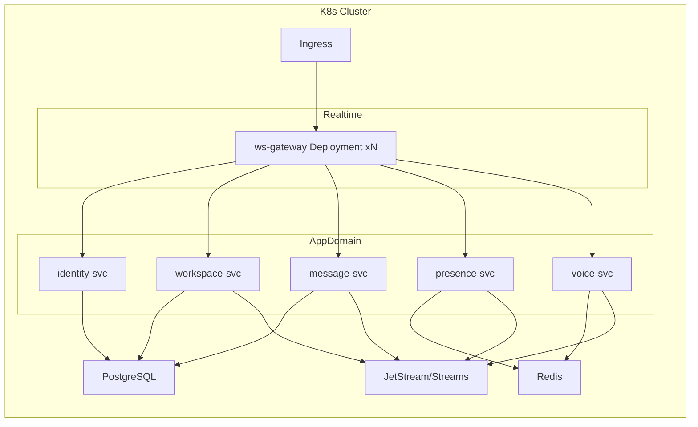
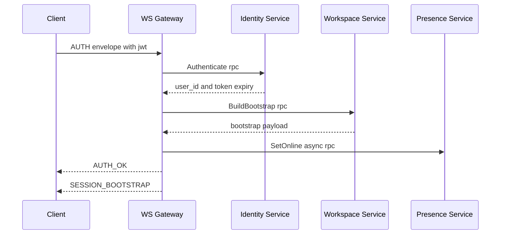
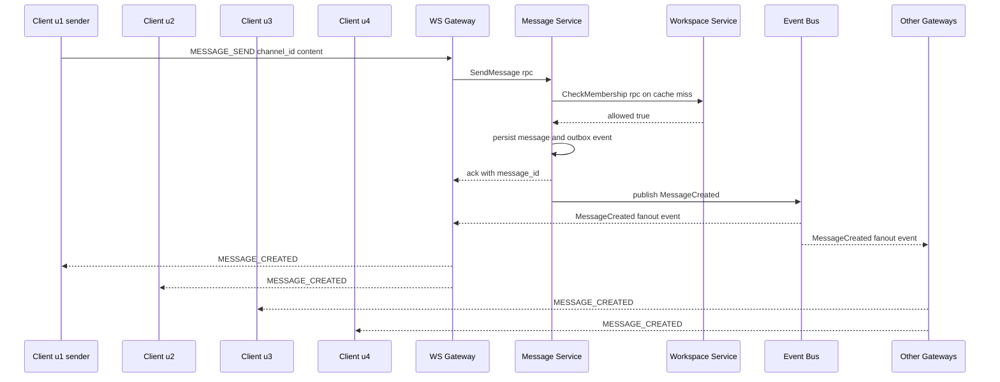
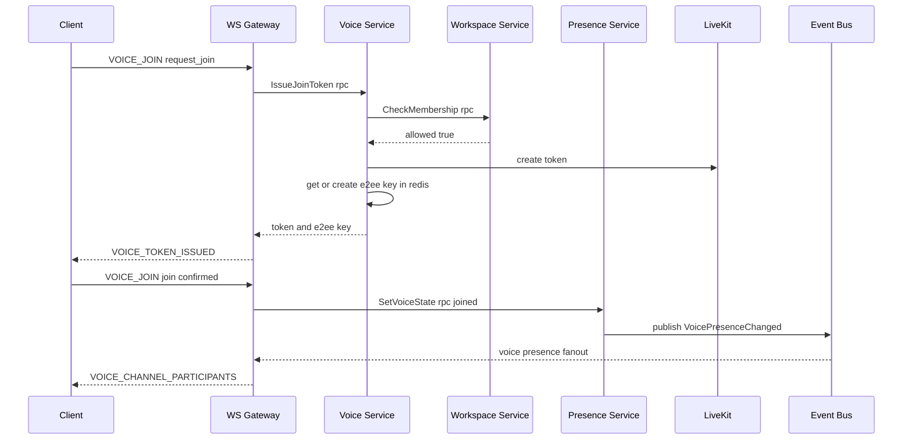

# AppStack Microservices Blueprint

This blueprint keeps the current `net` layer as the WebSocket connection owner and splits the `app` domain logic into independent services.

## Goal

Build a resilient backend where:
- WebSocket connections stay alive in gateway processes.
- Domain failures are isolated (degraded mode instead of full outage).
- Services can scale independently by workload.

## Principles

1. Keep `net` monolithic by design (connection-heavy, stateful, low-latency path).
2. Move domain logic out of `AppStack` into service APIs.
3. Prefer async event fanout for cross-service updates.
4. Explicitly define degraded behavior per service.

## Target Topology



## Request/Event Flow



## Service Boundary Mapping (from current `AppStack`)

- Identity Service
  - From: `AuthService`, `UserService` read/update profile operations
  - Contracts: `Authenticate`, `GetUser`, `UpdateUserProfile`
- Workspace Service
  - From: `HubService`, `ChannelService` structure/membership rules
  - Contracts: `CreateHub`, `JoinHub`, `CreateChannel`, `RenameChannel`
- Message Service
  - From: `ChannelService` message operations + fetch commands
  - Contracts: `SendMessage`, `FetchLatest`, `FetchBefore`
- Presence Service
  - From: `PresenceService`, `SessionManager`-adjacent presence aspects
  - Contracts: `SetOnline`, `SetTyping`, `SetVoiceState`, `GetPresenceSnapshot`
- Voice Service
  - From: `LiveKitTokenService` and voice key lifecycle
  - Contracts: `IssueJoinToken`, `ReleaseVoiceSession`, `GetOrCreateE2EEKey`

`AppStack` becomes orchestration only:
- Parse inbound envelope
- Call one or more service RPCs
- Push outbound intents to `NetworkRouter`

## Technology Choices

### Transport and Contracts

- Synchronous internal calls: `gRPC + protobuf`
  - Why: strong typing, explicit contracts, good fit with your existing proto usage.
- Asynchronous fanout/events: choose one
  - `NATS JetStream` (recommended): simple pub/sub + durable consumers + replay.
  - `Redis Streams` (low-friction alternative): reuse existing Redis footprint.

### Data

- `PostgreSQL`: primary durable store.
- `Redis`: ephemeral state, presence snapshots, short TTL caches, lightweight distributed locks.
- Pattern: start with one DB cluster, separate schemas per service, split physically later.

### Runtime and Delivery

- Local dev: `docker compose` with gateway + services + Postgres + Redis + bus.
- Production: `Kubernetes` (Deployments, HPA, rolling updates, pod anti-affinity).
- Edge routing: existing reverse proxy stays; route only to gateway pods.

### Reliability/Resilience Tooling

- Retries with bounded exponential backoff (only for idempotent operations).
- Circuit breaker and timeout per downstream call.
- Bulkheads: separate worker/thread pools per service client in gateway.
- Health checks: `liveness`, `readiness`, dependency-aware startup checks.
- Observability:
  - Metrics: `Prometheus`
  - Logs: structured JSON
  - Tracing: `OpenTelemetry` + Jaeger/Tempo

## Failure and Degraded Mode Matrix

| Down service | Gateway behavior | User-visible result |
|---|---|---|
| Identity | Reject auth + keep socket open briefly for retry | User cannot sign in |
| Workspace | Keep connection, block hub/channel mutations | Existing open channel view may remain |
| Message | Switch to read-only mode or queue writes async | Sending disabled, reading may continue |
| Presence | Skip typing/online fanout | Chat works, presence stale/unknown |
| Voice | Return explicit `VOICE_UNAVAILABLE` errors | Text works, voice unavailable |

Rules:
- Do not crash gateway on app-service failures.
- Return typed protocol errors instead of dropping socket.
- Keep heartbeats and connection lifecycle independent of domain service health.

## Suggested SLO and Timeout Baselines

- Internal RPC timeout: `150-400ms` per call (command-dependent).
- End-to-end command budget: `< 1s` for normal operations.
- Retry policy: max 1 retry for safe idempotent reads; no blind retries for writes without request id.
- Availability target:
  - Gateway plane: `99.95%`
  - Non-critical services (presence/voice): `99.9%`

## Incremental Migration Plan

1. Stabilize contracts in-process.
   - Introduce interfaces in `AppStack` (`IIdentityClient`, `IMessageClient`, etc.).
   - Keep local adapters first to avoid behavior change.
2. Extract Voice Service first.
   - Lowest coupling, easy fallback (`voice unavailable`).
3. Extract Presence Service.
   - Move ephemeral state to Redis, tolerate eventual consistency.
4. Extract Message Service.
   - Add idempotency key (`request_id`) and delivery events.
5. Extract Workspace + Identity last.
   - Highest coupling with permissions and memberships.

Exit criteria per phase:
- No change in client protocol surface.
- Can kill extracted service without gateway crash.
- Degraded behavior validated in integration tests.

## Deployment Model



## Minimum First Step in This Repo

1. Add service-client interfaces and adapters in `app/`.
2. Move only `LiveKitTokenService` calls behind `IVoiceClient`.
3. Keep current transport + dispatcher + envelope contract unchanged.
4. Add failure mapping: timeout/circuit-breaker -> `CommandError` payloads (not socket drop).

This gives microservice-ready seams without forcing a big-bang rewrite.

## Example Proto Contracts

```proto
syntax = "proto3";

package sercom.identity.v1;

service IdentityService {
  rpc Authenticate(AuthenticateRequest) returns (AuthenticateResponse);
}

message AuthenticateRequest {
  string jwt = 1;
  string request_id = 2;
}

message AuthenticateResponse {
  string user_id = 1;
  int64 expires_at_unix_ms = 2;
}
```

```proto
syntax = "proto3";

package sercom.workspace.v1;

service WorkspaceService {
  rpc BuildBootstrap(BuildBootstrapRequest) returns (BuildBootstrapResponse);
  rpc CheckMembership(CheckMembershipRequest) returns (CheckMembershipResponse);
}

message BuildBootstrapRequest {
  string user_id = 1;
}

message BuildBootstrapResponse {
  bytes session_bootstrap_envelope = 1;
}

message CheckMembershipRequest {
  string user_id = 1;
  string channel_id = 2;
}

message CheckMembershipResponse {
  bool allowed = 1;
}
```

```proto
syntax = "proto3";

package sercom.message.v1;

service MessageService {
  rpc SendMessage(SendMessageRequest) returns (SendMessageResponse);
}

message SendMessageRequest {
  string request_id = 1;
  string user_id = 2;
  string channel_id = 3;
  string content = 4;
}

message SendMessageResponse {
  string message_id = 1;
  int64 created_at_unix_ms = 2;
}
```

```proto
syntax = "proto3";

package sercom.voice.v1;

service VoiceService {
  rpc IssueJoinToken(IssueJoinTokenRequest) returns (IssueJoinTokenResponse);
}

message IssueJoinTokenRequest {
  string request_id = 1;
  string user_id = 2;
  string channel_id = 3;
}

message IssueJoinTokenResponse {
  string livekit_token = 1;
  string e2ee_key = 2;
}
```

## Flow 1 Authenticate and Bootstrap



Gateway command handler example:

```cpp
void GatewayDispatcher::handleAuth(const InboundEvent& ev) {
  identity::v1::AuthenticateRequest auth_req;
  auth_req.set_jwt(ev.auth_jwt);
  auth_req.set_request_id(ev.request_id);

  auto auth_res = identity_client_.Authenticate(auth_req, 250);
  if (!auth_res.ok()) {
    send_command_error(ev.conn_id, "AUTH_FAILED");
    return;
  }

  session_store_.upsert(Session{
      .conn_id = ev.conn_id,
      .user_id = auth_res->user_id(),
      .auth_expiry_unix_ms = auth_res->expires_at_unix_ms(),
  });

  workspace::v1::BuildBootstrapRequest boot_req;
  boot_req.set_user_id(auth_res->user_id());
  auto boot_res = workspace_client_.BuildBootstrap(boot_req, 300);
  if (!boot_res.ok()) {
    send_command_error(ev.conn_id, "BOOTSTRAP_FAILED");
    return;
  }

  presence::v1::SetOnlineRequest online_req;
  online_req.set_user_id(auth_res->user_id());
  online_req.set_state("ONLINE");
  presence_client_.SetOnlineAsync(online_req);

  send_auth_ok(ev.conn_id, auth_res->user_id(), auth_res->expires_at_unix_ms());
  send_raw_envelope(ev.conn_id, boot_res->session_bootstrap_envelope());
}
```

Minimal gRPC client call style:

```cpp
Result<identity::v1::AuthenticateResponse> IdentityClient::Authenticate(
    const identity::v1::AuthenticateRequest& req, int timeout_ms) {
  grpc::ClientContext ctx;
  ctx.set_deadline(std::chrono::system_clock::now() +
                   std::chrono::milliseconds(timeout_ms));

  identity::v1::AuthenticateResponse res;
  grpc::Status status = stub_->Authenticate(&ctx, req, &res);
  if (!status.ok()) return Error::fromGrpc(status);
  return res;
}
```

## Flow 2 Send Message in Channel with Four Users Online

Assume online users in channel are `u1 u2 u3 u4` and sender is `u1`.
Assume `u1 u2` are connected to `G` and `u3 u4` are connected to `G2`.



Gateway send message handler:

```cpp
void GatewayDispatcher::handleSendMessage(const InboundEvent& ev) {
  auto session = session_store_.get_by_conn(ev.conn_id);
  if (!session) {
    send_command_error(ev.conn_id, "UNAUTHENTICATED");
    return;
  }

  message::v1::SendMessageRequest req;
  req.set_request_id(ev.request_id);
  req.set_user_id(session->user_id);
  req.set_channel_id(ev.channel_id);
  req.set_content(ev.content);

  auto res = message_client_.SendMessage(req, 350);
  if (!res.ok()) {
    send_command_error(ev.conn_id, "MESSAGE_SEND_FAILED");
    return;
  }

  send_ack(ev.conn_id, ev.request_id, "MESSAGE_ACCEPTED");
}
```

Message service with ownership checks, idempotency, and outbox:

```cpp
grpc::Status MessageServiceImpl::SendMessage(
    grpc::ServerContext* ctx,
    const message::v1::SendMessageRequest* req,
    message::v1::SendMessageResponse* res) {
  if (!idempotency_store_.try_begin(req->request_id())) {
    return grpc::Status(grpc::StatusCode::ALREADY_EXISTS, "duplicate request");
  }

  bool allowed = membership_cache_.get(req->user_id(), req->channel_id());
  if (!allowed) {
    workspace::v1::CheckMembershipRequest check_req;
    check_req.set_user_id(req->user_id());
    check_req.set_channel_id(req->channel_id());
    auto check_res = workspace_client_.CheckMembership(check_req, 150);
    if (!check_res.ok() || !check_res->allowed()) {
      return grpc::Status(grpc::StatusCode::PERMISSION_DENIED, "not a member");
    }
    membership_cache_.put(req->user_id(), req->channel_id(), true, 30);
  }

  auto tx = db_.begin_tx();
  auto row = message_repo_.insert(tx, req->channel_id(), req->user_id(), req->content());
  outbox_repo_.insert(tx, "MessageCreated", build_message_created_event(row));
  tx.commit();

  res->set_message_id(row.message_id);
  res->set_created_at_unix_ms(row.created_at_unix_ms);
  return grpc::Status::OK;
}
```

Gateway fanout consumer:

```cpp
void MessageCreatedConsumer::onEvent(const MessageCreatedEvent& ev) {
  auto conns = subscription_manager_.connections_for_topic(topic_for_channel(ev.channel_id));
  for (const auto& conn_id : conns) {
    send_message_created(conn_id, ev);
  }
}
```

## Flow 3 Join Voice Channel



Gateway handler for request join:

```cpp
void GatewayDispatcher::handleVoiceJoinRequest(const InboundEvent& ev) {
  auto session = session_store_.get_by_conn(ev.conn_id);
  if (!session) {
    send_command_error(ev.conn_id, "UNAUTHENTICATED");
    return;
  }

  voice::v1::IssueJoinTokenRequest req;
  req.set_request_id(ev.request_id);
  req.set_user_id(session->user_id);
  req.set_channel_id(ev.channel_id);

  auto res = voice_client_.IssueJoinToken(req, 300);
  if (!res.ok()) {
    send_command_error(ev.conn_id, "VOICE_UNAVAILABLE");
    return;
  }

  send_voice_token_issued(ev.conn_id, ev.channel_id, res->livekit_token(), res->e2ee_key());
}
```

Voice service sample:

```cpp
grpc::Status VoiceServiceImpl::IssueJoinToken(
    grpc::ServerContext* ctx,
    const voice::v1::IssueJoinTokenRequest* req,
    voice::v1::IssueJoinTokenResponse* res) {
  workspace::v1::CheckMembershipRequest check_req;
  check_req.set_user_id(req->user_id());
  check_req.set_channel_id(req->channel_id());
  auto check_res = workspace_client_.CheckMembership(check_req, 150);
  if (!check_res.ok() || !check_res->allowed()) {
    return grpc::Status(grpc::StatusCode::PERMISSION_DENIED, "not a member");
  }

  std::string token = livekit_client_.mint_join_token(req->user_id(), req->channel_id());
  std::string e2ee_key = redis_store_.get_or_create_e2ee_key(req->channel_id(), 3600);

  res->set_livekit_token(token);
  res->set_e2ee_key(e2ee_key);
  return grpc::Status::OK;
}
```

## Shared Resources, Caching, and Invalidation

Core rule:
- Services can share infrastructure
- Services should not share mutable domain tables directly

Recommended ownership:

| Service | Owns durable data | Owns cache keys |
|---|---|---|
| Identity | users auth mappings | `identity:user:*` |
| Workspace | hubs channels memberships | `workspace:member:*` |
| Message | messages reactions message index | `message:channel:*` |
| Presence | online typing voice state | `presence:user:*` |
| Voice | voice session token metadata e2ee refs | `voice:channel:*` |

How services interact:
- Query path uses gRPC request response.
- State propagation uses event bus events.
- Read models in other services are eventually consistent caches.

Cache model:
- L1 cache in each service process for very hot reads.
- L2 cache in Redis with service specific key prefixes.
- TTL on all Redis keys for safety.
- Event driven invalidation for fast freshness.

Example invalidation event:

```json
{
  "type": "WorkspaceMembershipChanged",
  "user_id": "u2",
  "channel_id": "c9",
  "new_state": "removed",
  "version": 42
}
```

Consumer side invalidation:

```cpp
void MembershipChangedConsumer::onEvent(const WorkspaceMembershipChanged& ev) {
  membership_cache_.erase(ev.user_id, ev.channel_id);
  permission_cache_.erase(ev.user_id, ev.channel_id);
}
```

Consistency guidance:
- For auth and permissions use strong consistency on write path.
- For presence and typing use eventual consistency.
- If cache and DB disagree, DB owner service is source of truth.
- Use version field in events to ignore stale updates.
