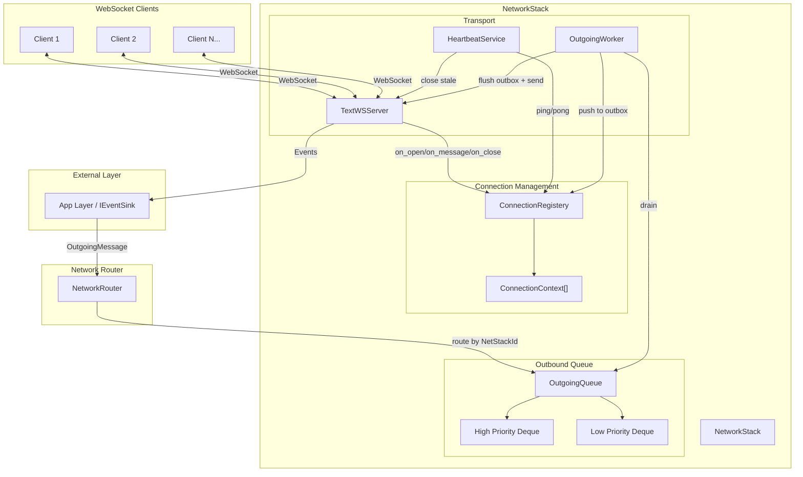
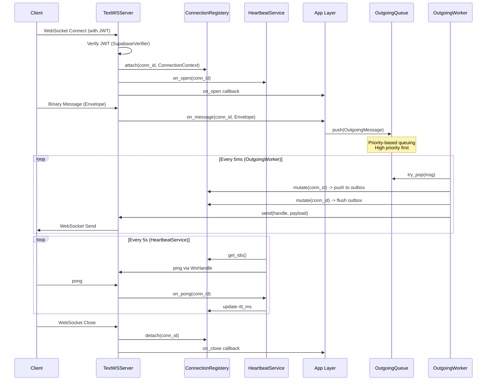

# Net Layer Architecture

## Overview Diagram

```mermaid
classDiagram
    direction TB

    %% ============================================
    %% ID TYPES
    %% ============================================
    class ConnId {
        +string value
    }
    class NetStackId {
        +string value
    }
    class GlobalConnId {
        +NetStackId netstack_id
        +ConnId conn_id
    }

    %% ============================================
    %% NETWORK STACK & ROUTER (Top Level)
    %% ============================================
    class NetworkRouter {
        -unordered_map~NetStackId, unique_ptr~NetworkStack~~ net_stacks_by_id_
        +register_stack(unique_ptr~NetworkStack~ stack) void
        +push(OutgoingMessage msg) PushResult
        +stop_all() void
        +start_all() void
        -group_outgoing_msg(OutgoingMessage&) map~NetStackId, vector~GlobalConnId~~
    }

    class NetworkStack {
        -NetStackId id_
        -NetworkStackConfig cfg_
        -IEventSink* event_sink_
        -jthread server_thread_
        -atomic~bool~ started_
        -atomic~bool~ stopped_
        -unique_ptr~ITransportServer~ transport_layer_
        -unique_ptr~ConnectionRegistery~ connection_registry_
        -unique_ptr~OutgoingQueue~ outgoing_queue_
        +loop_id() LoopId
        +start() bool
        +stop() bool
        +outbound_sink() IOutboundSink&
        +attach_event_sink(IEventSink& sink) void
        +id() NetStackId
        -run_server() void
        -wire_components() void
    }

    NetworkRouter "1" *-- "*" NetworkStack : manages
    NetworkRouter ..|> IOutboundSink : implements

    %% ============================================
    %% CONNECTION LAYER
    %% ============================================
    class HeartbeatState {
        +bool alive
        +time_point connected_at
        +time_point last_ping_at
        +time_point last_pong_at
        +milliseconds rtt_ms
    }

    class AuthState {
        +bool is_authenticated
        +time_point expires_at
    }

    class PerConnectionOutbox {
        +deque~OutgoingMessage~ q
        +size_t capacity = 128
        +uint32_t slow_hits
        +bool drop_pending
    }

    class ConnectionContext {
        +ConnId conn_id
        +WsHandle handle
        +TransportKind kind
        +HeartbeatState heartbeat
        +AuthState auth
        +deque~pair~string, OpCode~~ pending
        +PerConnectionOutbox outbox
    }

    class ConnectionView {
        +ConnId conn_id
        +WsHandle handle
        +TransportKind kind
        +AuthState auth
    }

    class OutboundReady {
        +WsHandle handle
        +OutgoingMessage msg
        +bool drop_pending
    }

    class ConnectionError {
        +string message
    }

    class ConnectionRegistery {
        -shared_mutex mutex_
        -unordered_map~ConnId, ConnectionContext~ connections_
        +attach(ConnId&, ConnectionContext) void
        +detach(ConnId&) void
        +get(ConnId&) ConnectionResult
        +get(vector~GlobalConnId~&) vector~ConnectionResult~
        +get() vector~ConnectionResult~
        +get_view(ConnId&) optional~ConnectionView~
        +get_ids() vector~ConnId~
        +take_one_outbound(ConnId&) optional~OutboundReady~
        +mutate(ConnId&, function) expected~void, ConnectionError~
        +size() size_t
    }

    ConnectionContext *-- HeartbeatState
    ConnectionContext *-- AuthState
    ConnectionContext *-- PerConnectionOutbox
    ConnectionRegistery "1" *-- "*" ConnectionContext : stores

    %% ============================================
    %% OUTBOUND MESSAGING
    %% ============================================
    class OutboundPriority {
        <<enumeration>>
        High = 0
        Low = 1
    }

    class Payload {
        +shared_ptr~const string~ data
        +bool is_binary = true
    }

    class Target {
        +vector~GlobalConnId~ conns
        +one(GlobalConnId) Target$
        +many(vector~GlobalConnId~) Target$
    }

    class SendPayload {
        +Payload payload
    }

    class UpdateAuthState {
        +bool is_authenticated
        +time_point expires_at
    }

    class DropConnection {
        +int code
        +string reason
    }

    class OutgoingMessage {
        +OutboundPriority priority
        +Target target
        +Action action
    }

    class PushResult {
        <<enumeration>>
        Ok
        DroppedLowPriority
        DroppedHighPriority
    }

    class IOutboundSink {
        <<interface>>
        +push(OutgoingMessage msg)* PushResult
    }

    class OutgoingQueue {
        -mutex mu_
        -deque~OutgoingMessage~ high_
        -deque~OutgoingMessage~ low_
        -size_t capacity_
        -size_t size_
        +push(OutgoingMessage msg) PushResult
        +pop(OutgoingMessage& out) bool
        +try_pop(OutgoingMessage& out) bool
        +size() size_t
        -push_impl(OutgoingMessage&&) PushResult
        -record_drop_low() void
        -record_drop_high() void
    }

    OutgoingMessage *-- OutboundPriority
    OutgoingMessage *-- Target
    OutgoingMessage o-- SendPayload : action variant
    OutgoingMessage o-- UpdateAuthState : action variant
    OutgoingMessage o-- DropConnection : action variant
    SendPayload *-- Payload
    OutgoingQueue ..|> IOutboundSink : implements

    %% ============================================
    %% TRANSPORT LAYER
    %% ============================================
    class TransportKind {
        <<enumeration>>
        TextWebSocket
        VoiceWebSocket
    }

    class Hooks {
        +function on_open
        +function on_message
        +function on_close
    }

    class ITransportServer {
        <<interface>>
        +start()* void
        +stop()* void
        +is_started()* bool
        +is_stopped()* bool
        +name()* const char*
        +loop_id()* void*
        +set_hooks(Hooks hooks)* void
    }

    class ILoop {
        <<interface>>
        +defer(DeferFn fn)* void
        +getUwsLoop()* uWS::Loop*
    }

    class IOutboundTransport {
        <<interface>>
        +send(WsHandle&, string_view, bool)* bool
        +is_backpressured(WsHandle&)* bool
    }

    class WsHandle {
        +UwsSocket* ws
        +valid() bool
        +send(string payload, bool binary) SendStatus
        +send(string_view payload, bool binary) SendStatus
        +end(int code, string reason) void
        +ping() void
    }

    class PerSocketData {
        +ConnId conn_id
        +UserId user_id
        +string role
        +int64_t exp
    }

    class IApp {
        <<interface>>
        +uws()* UwsApp&
    }

    class WsLimits {
        +size_t max_message_bytes = 256KB
        +uint8_t max_connections = 255
    }

    class OriginAllowlist {
        +is_allowed(string& origin) bool
    }

    class TextWSServer {
        -NetworkStackConfig cfg_
        -OriginAllowlist origins_
        -WsLimits limits_
        -ConnectionRegistery& conns_
        -unique_ptr~IApp~ app_
        -us_listen_socket_t* listen_token_
        -atomic~uWS::Loop*~ loop_
        -HeartbeatService heartbeat_service_
        -OutgoingWorker out_worker_
        -Hooks hooks_
        -optional~SupabaseVerifier~ auth_
        -ConnIdGenerator conn_id_gen_
        -atomic~bool~ started_
        -atomic~bool~ stopped_
        -atomic~bool~ stop_requested_
        -atomic~uint64_t~ active_connections_
        +start() void
        +stop() void
        +is_started() bool
        +is_stopped() bool
        +name() const char*
        +loop_id() void*
        +set_hooks(Hooks hooks) void
        +send(WsHandle&, string_view, bool) bool
        +is_backpressured(WsHandle&) bool
        -wire() void
    }

    IApp --|> ILoop : extends
    TextWSServer ..|> ITransportServer : implements
    TextWSServer ..|> IOutboundTransport : implements
    TextWSServer --> ConnectionRegistery : uses
    TextWSServer --> OutgoingQueue : uses
    TextWSServer *-- HeartbeatService
    TextWSServer *-- OutgoingWorker
    TextWSServer --> WsHandle : creates
    WsHandle --> PerSocketData : socket data

    %% ============================================
    %% RUNTIME SERVICES
    %% ============================================
    class HeartbeatConfig {
        +seconds interval = 5
        +seconds timeout = 15
        +int close_code = 4000
        +const char* close_reason
    }

    class HeartbeatService {
        -ILoop& loop_
        -ConnectionRegistery& conns_
        -HeartbeatConfig cfg_
        -atomic~bool~ running_
        -us_timer_t* timer_
        +start() void
        +stop() void
        +on_open(ConnId conn_id) void
        +on_pong(ConnId conn_id) expected~string, ConnectionError~
        -on_timer(us_timer_t* timer)$ void
        -tick() void
        -make_conn_status_msg(bool alive, int rtt_ms) string
    }

    class OutgoingWorkerConfig {
        +milliseconds interval = 5
        +microseconds time_budget = 1000
        +size_t max_per_tick = 256
    }

    class OutgoingWorker {
        -ILoop& loop_
        -ConnectionRegistery& conns_
        -OutgoingQueue& out_q_
        -OutgoingWorkerConfig cfg_
        -atomic~bool~ running_
        -us_timer_t* timer_
        +start() void
        +stop() void
        -on_timer(us_timer_t* timer)$ void
        -tick() void
    }

    HeartbeatService --> ILoop : uses
    HeartbeatService --> ConnectionRegistery : manages heartbeats
    HeartbeatService *-- HeartbeatConfig
    
    OutgoingWorker --> ILoop : uses
    OutgoingWorker --> ConnectionRegistery : reads connections
    OutgoingWorker --> OutgoingQueue : drains messages
    OutgoingWorker *-- OutgoingWorkerConfig

    %% ============================================
    %% EXTERNAL DEPENDENCIES
    %% ============================================
    class IEventSink {
        <<interface>>
        +push(Event& event)* PushResult
        +push(Event&& event)* PushResult
    }

    NetworkStack ..> IEventSink : receives events from transport
```

## Data Flow Diagram

## Message Flow Sequence

## Component Responsibilities

| Component | Namespace | Responsibility |
|-----------|-----------|----------------|
| `NetworkRouter` | `net` | Routes outgoing messages to correct NetworkStack by NetStackId |
| `NetworkStack` | `net` | Manages one transport + connection registry + outbound queue |
| `ConnectionRegistery` | `net::connection` | Thread-safe storage of active connections with contexts |
| `ConnectionContext` | `net::connection` | Per-connection state: handle, heartbeat, auth, outbox |
| `TextWSServer` | `net::transport::websocket` | WebSocket server using uWebSockets |
| `HeartbeatService` | `net::runtime` | Periodic ping/pong, detects stale connections |
| `OutgoingQueue` | `net::outbound` | Priority queue for outbound messages |
| `OutgoingWorker` | `net::outbound` | Drains queue, fills per-connection outboxes, and flushes outbound actions |
| `WsHandle` | `net::transport` | Wrapper for uWS WebSocket pointer with send/close/ping |

## Key Fields to Consider for Updates

### ConnectionContext Fields
| Field | Type | Description |
|-------|------|-------------|
| `conn_id` | `ConnId` | Unique connection identifier |
| `handle` | `WsHandle` | uWebSockets handle for sending |
| `kind` | `TransportKind` | Text or Voice WebSocket |
| `heartbeat` | `HeartbeatState` | Connection liveness tracking |
| `auth` | `AuthState` | Authentication state & expiry |
| `pending` | `deque<pair<string, OpCode>>` | Backpressure buffer |
| `outbox` | `PerConnectionOutbox` | Per-connection message queue |

### OutgoingMessage Fields
| Field | Type | Description |
|-------|------|-------------|
| `priority` | `OutboundPriority` | High (0) or Low (1) |
| `target` | `Target` | List of GlobalConnIds to send to |
| `action` | `variant<SendPayload, UpdateAuthState, DropConnection>` | What to do |

### TextWSServer Fields
| Field | Type | Description |
|-------|------|-------------|
| `cfg_` | `NetworkStackConfig` | Port, host, TLS config |
| `limits_` | `WsLimits` | Max message size (256KB), max connections (255) |
| `origins_` | `OriginAllowlist` | CORS origin validation |
| `auth_` | `optional<SupabaseVerifier>` | JWT verification |
| `active_connections_` | `atomic<uint64_t>` | Connection count |

### HeartbeatConfig Fields
| Field | Type | Default | Description |
|-------|------|---------|-------------|
| `interval` | `seconds` | 5 | Time between pings |
| `timeout` | `seconds` | 15 | Max time without pong |
| `close_code` | `int` | 4000 | WebSocket close code |
| `close_reason` | `const char*` | "Client did not respond..." | Close reason |

### OutgoingWorkerConfig Fields
| Field | Type | Default | Description |
|-------|------|---------|-------------|
| `interval` | `milliseconds` | 5 | Timer tick interval |
| `time_budget` | `microseconds` | 1000 | Max time per tick |
| `max_per_tick` | `size_t` | 256 | Max messages per tick |
