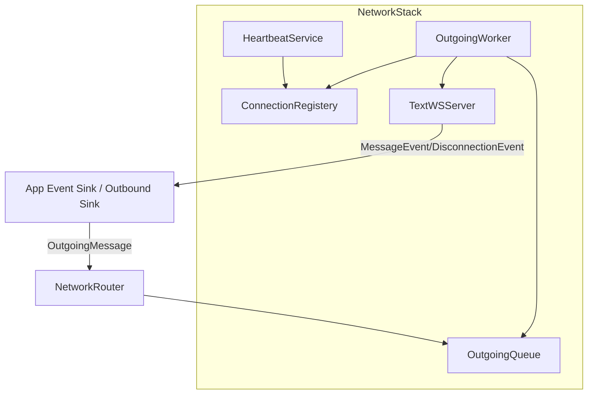

# Net Layer Architecture

This document reflects the current network layer in `net/`.

## Layered Structure

## Core Types

From `net/outbound/Msg.h`:
- `OutgoingMessage`
- `Target` (`one` / `many` `GlobalConnId`)
- `Action` variant:
- `SendPayload`
- `UpdateAuthState`
- `DropConnection`

From `net/connection/ConnectionRegistery.h`:
- `ConnectionContext`
- `HeartbeatState`
- `AuthState` (`UNAUTHED`, `AUTHONFLY`, `AUTHED`)
- per-connection pending deque and per-connection outbox

## NetworkRouter

`net/NetworkRouter.cpp`:
- Groups targets by `NetStackId`
- Forwards one message per stack to that stack's `outbound_sink()`
- Aggregates push status (`Ok`, `DroppedLowPriority`, `DroppedHighPriority`)

## NetworkStack Wiring

`net/NetworkStack.cpp` builds:
1. `ConnectionRegistery`
2. `OutgoingQueue`
3. `TextWSServer`
4. transport hooks to push app events

Hook mapping in `NetworkStack::wire_components()`:
- `on_message` -> `MessageEvent`
- `on_close` -> `DisconnectionEvent`

Note:
- `on_open` hook is wired but intentionally not invoked by `TextWSServer`; initial bootstrap is auth-driven (AuthenticateCommand enqueues `ConnectionEvent`).

## WebSocket Transport (`TextWSServer`)

`net/transport/websocket/WebSocketTransport.cpp` behavior:
- Upgrade requires `Authorization: supabase <jwt>` (or cookie-derived header via Caddy)
- Origin allowlist permits localhost/127.0.0.1/192.168.*
- Connection count capped by `WsLimits.max_connections` (default 255)

Open flow:
1. connection attached with `AUTHONFLY`
2. heartbeat state initialized
3. synthetic `AUTH` envelope is injected via hook from token captured at upgrade

Message flow:
- Binary protobuf only
- Envelope version must be `1`
- `PING` fast-path handled in transport (responds with app-level `PONG`)
- Other envelopes forwarded to app layer hook

Close flow:
- Detach connection from registry
- Emit `DisconnectionEvent`

## Heartbeat and Auth Timeouts

`net/runtime/HeartbeatService.cpp` periodic checks:
- If `UNAUTHED` -> close `4401` (`unauthenticated`)
- If `AUTHED` but token expired -> close `4402` (`auth_token_expired`)
- If `AUTHONFLY` beyond grace period (10s) -> close `4403` (`authentication_timeout`)
- If RTT exceeds timeout -> close configured heartbeat close code (default `4000`)

Heartbeat defaults (`HeartbeatConfig`):
- interval: `5s`
- timeout: `15s`

## Outbound Processing

`net/outbound/OutgoingWorker.cpp`:
- Timer tick every `5ms` (default)
- Tick constraints: max `256` messages and `1ms` time budget by default

Processing stages:
1. Drain shared `OutgoingQueue`
2. Fanout into per-connection outboxes
3. Flush per-connection actions

Per-connection outbox policy:
- Capacity `128`
- Prefer dropping low-priority on overflow
- Repeated overflow increments `slow_hits`; after threshold queue may be cleared (`drop_pending` path)

Actions:
- `SendPayload`: send binary/text via transport
- `UpdateAuthState`: mutate auth state in registry
- `DropConnection`: close socket and clear queue

## Connection Registry Concurrency

`ConnectionRegistery` uses `std::shared_mutex`:
- shared reads for `get*`
- exclusive writes for `attach`, `detach`, `mutate`

`get_view()` provides lightweight snapshots for hot paths.

## Transport Interfaces

- `ITransportServer` (`start/stop`, lifecycle, hooks)
- `IOutboundTransport` (`send`, `is_backpressured`)
- `WsHandle` wraps uWebSockets handle operations (`send`, `end`, `ping`)

## Operational Notes

- Voice and text signaling both currently travel through `TextWSServer`; voice media itself is handled by LiveKit.
- `TransportKind::VoiceWebSocket` exists in enums but there is no separate voice websocket server wired in `NetworkStack` today.
