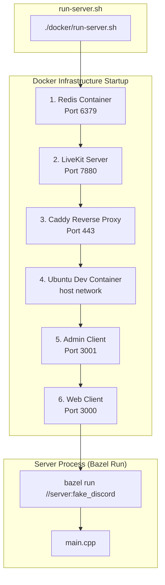
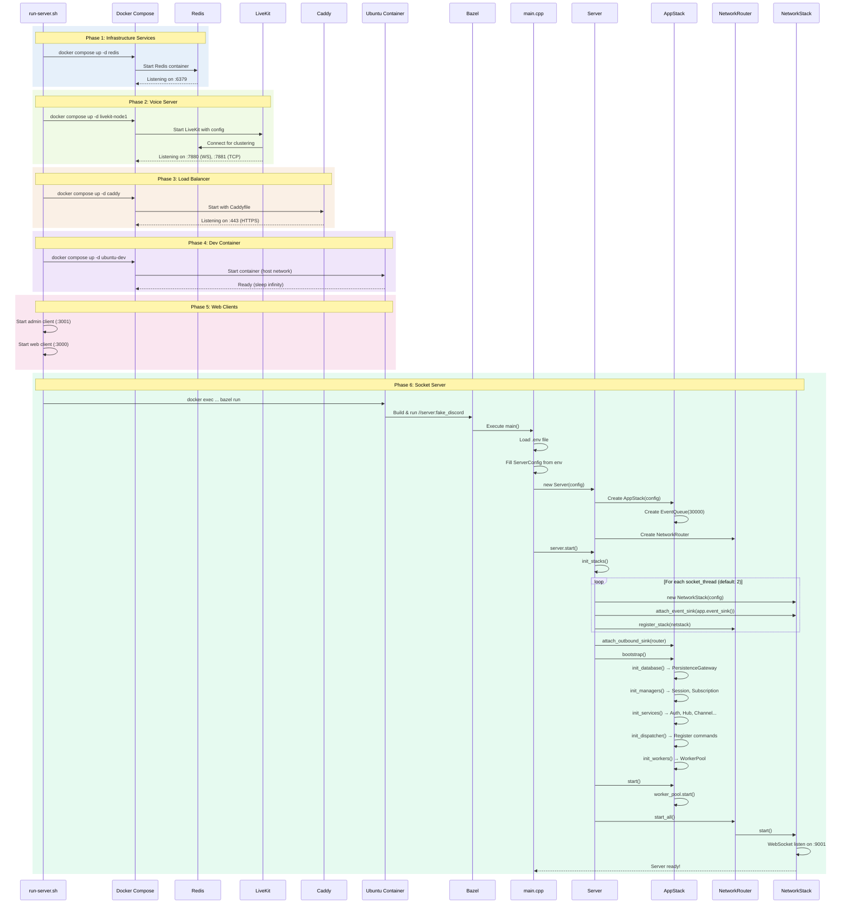
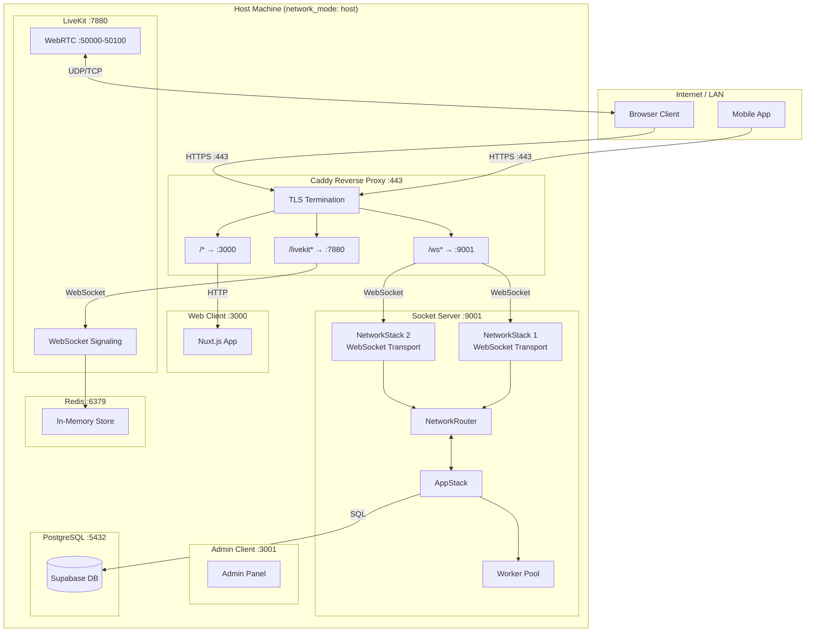
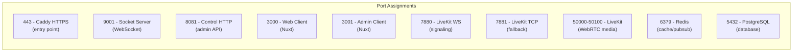
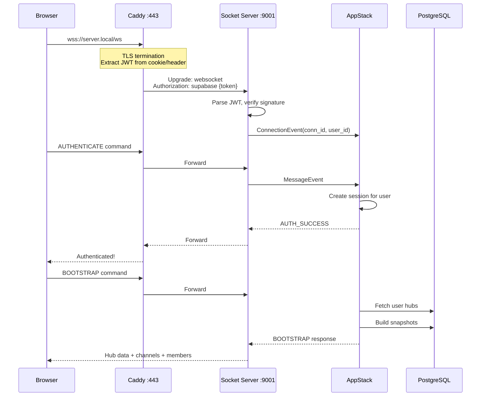
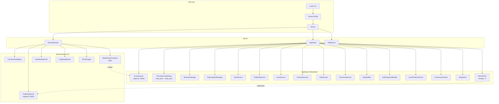

# Server Startup Flow

## Complete Startup Trace: docker/run-server.sh → Ready State



## Detailed Startup Sequence



## Network Topology After Startup



## Port Mapping Summary



## Connection Flow: From Browser to Server



## Component Wiring Diagram



## Initialization Order

| Step | Component | Action |
|------|-----------|--------|
| 1 | `main.cpp` | Load `.env` file |
| 2 | `main.cpp` | Fill `ServerConfig` from environment |
| 3 | `main.cpp` | Create `Server(config)` |
| 4 | `Server` | Create `AppStack(config)` |
| 5 | `AppStack` | Create `EventQueue(30000)` |
| 6 | `Server` | Create `NetworkRouter` |
| 7 | `Server::init_stacks()` | Loop: Create `NetworkStack` × socket_threads |
| 8 | `Server::init_stacks()` | Attach NetworkStack → AppStack.event_sink |
| 9 | `Server::init_stacks()` | Register NetworkStack → NetworkRouter |
| 10 | `Server` | Attach AppStack → NetworkRouter (outbound) |
| 11 | `AppStack::bootstrap()` | `init_database()` → PersistenceGateway |
| 12 | `AppStack::bootstrap()` | `init_managers()` → Session, Subscription |
| 13 | `AppStack::bootstrap()` | `init_services()` → All services |
| 14 | `AppStack::bootstrap()` | `init_dispatcher()` → Register commands |
| 15 | `AppStack::bootstrap()` | `init_workers()` → Create WorkerPool |
| 16 | `Server::start()` | `AppStack.start()` → Start worker threads |
| 17 | `Server::start()` | `NetworkRouter.start_all()` → Listen on :9001 |
| 18 | `Server::start()` | `HttpServer.start()` → Listen on :8081 |

## Environment Variables

| Variable | Default | Used By |
|----------|---------|---------|
| `LISTEN_HOST` | `0.0.0.0` | NetworkStack |
| `SOCKET_PORT` | `9001` | NetworkStack |
| `SOCKET_PATTERN` | `/*` | NetworkStack |
| `OUTBOUND_QUEUE_CAPACITY` | `50000` | OutgoingQueue |
| `EVENT_QUEUE_CAPACITY` | `30000` | EventQueue |
| `DB_ENGINE` | `postgresql` | PersistenceGateway |
| `DB_HOST` | `localhost` | PersistenceGateway |
| `DB_PORT` | `5432` | PersistenceGateway |
| `DB_USER` | `postgres` | PersistenceGateway |
| `DB_PASSWORD` | `password` | PersistenceGateway |
| `DB_NAME` | `postgres` | PersistenceGateway |
| `DB_POOL_SIZE` | `3` | PersistenceGateway |
| `LIVEKIT_API_KEY` | (required) | LiveKitTokenService |
| `LIVEKIT_API_SECRET` | (required) | LiveKitTokenService |
| `CONTROL_HOST` | `127.0.0.1` | HttpServer |
| `CONTROL_PORT` | `8081` | HttpServer |
| `REDIS_HOST` | `redis` | (LiveKit uses) |
| `REDIS_PORT` | `6379` | (LiveKit uses) |

## Docker Container State After Startup

```
┌─────────────────────────────────────────────────────────────────────┐
│  RUNNING CONTAINERS                                                  │
├─────────────────────────────────────────────────────────────────────┤
│                                                                      │
│  ┌─────────────┐  ┌─────────────┐  ┌─────────────┐                  │
│  │   redis     │  │  livekit    │  │   caddy     │                  │
│  │   :6379     │  │   :7880     │  │   :443      │                  │
│  │   alpine    │  │   :7881     │  │   TLS       │                  │
│  └─────────────┘  │   :50000+   │  └─────────────┘                  │
│                   └─────────────┘                                    │
│                                                                      │
│  ┌───────────────────────────────────────────────────────────────┐  │
│  │  sercom-dev-ubuntu (host network)                             │  │
│  │  ┌─────────────────────────────────────────────────────────┐  │  │
│  │  │  bazel run //server:fake_discord                        │  │  │
│  │  │  └── Socket Server :9001                                │  │  │
│  │  │  └── Control HTTP :8081                                 │  │  │
│  │  └─────────────────────────────────────────────────────────┘  │  │
│  └───────────────────────────────────────────────────────────────┘  │
│                                                                      │
│  ┌─────────────┐  ┌─────────────┐                                   │
│  │ web-client  │  │admin-client │                                   │
│  │   :3000     │  │   :3001     │                                   │
│  │   Nuxt      │  │   Nuxt      │                                   │
│  └─────────────┘  └─────────────┘                                   │
│                                                                      │
└─────────────────────────────────────────────────────────────────────┘
```

## Request Flow Summary

```
Browser → :443 (Caddy)
           │
           ├── /ws/*      → :9001 (Socket Server) → WebSocket connection
           │                  └── Events → AppStack → Commands → Response
           │
           ├── /livekit/* → :7880 (LiveKit) → Voice signaling
           │                  └── WebRTC → :50000-50100
           │
           └── /*         → :3000 (Web Client) → Nuxt app
```
