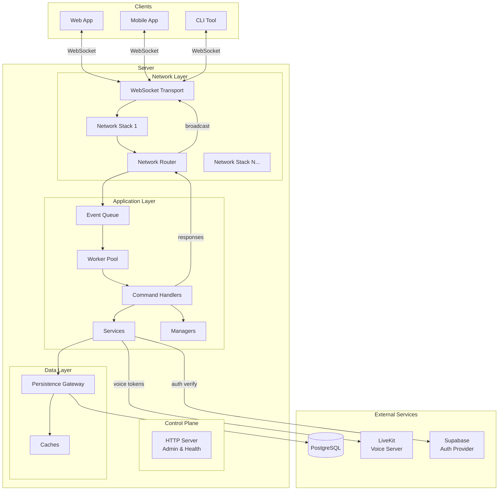
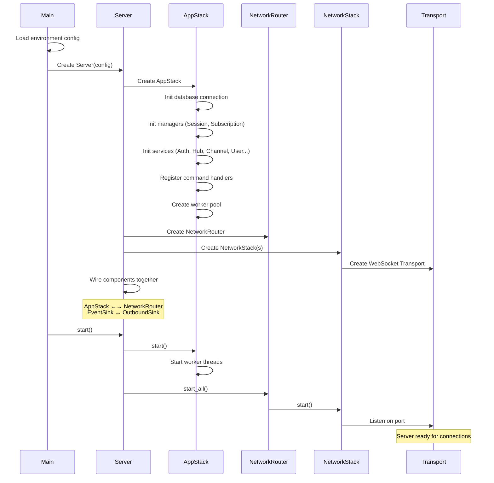
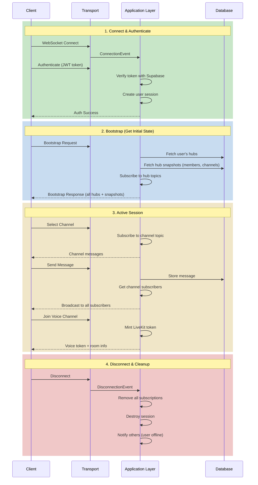
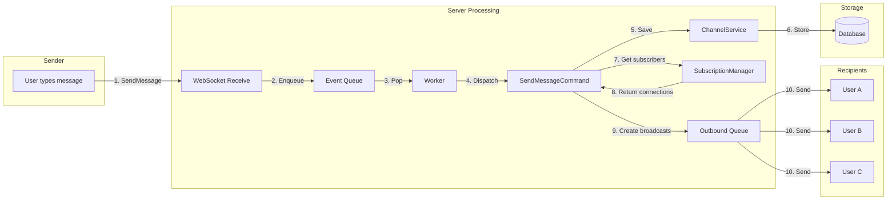
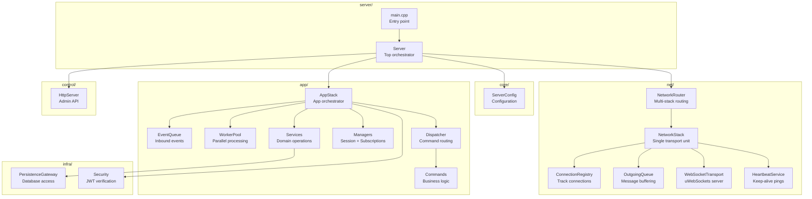
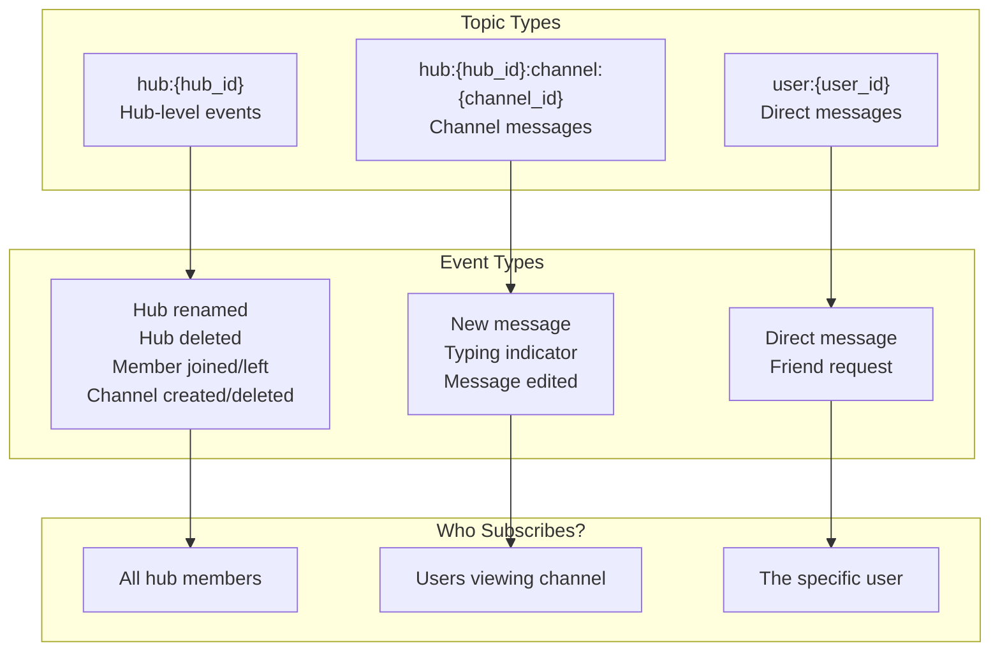
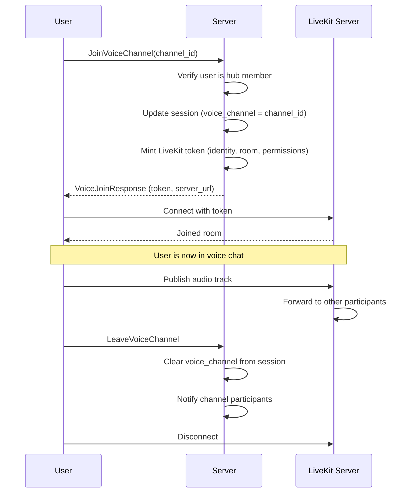

# System Overview

## High-Level Architecture



## Server Startup Sequence



## Client Lifecycle



## Message Flow: Sending a Chat Message



## Module Overview



## Pub/Sub Topic System



## Voice Channel Flow



## Key Concepts Summary

| Concept | What It Does | Where It Lives |
|---------|--------------|----------------|
| **Server** | Orchestrates all components | `server/` |
| **NetworkStack** | Handles one WebSocket listener + connections | `net/` |
| **NetworkRouter** | Routes messages to correct NetworkStack | `net/` |
| **AppStack** | Business logic orchestrator | `app/` |
| **EventQueue** | Buffers inbound events with priority | `app/queue/` |
| **WorkerPool** | Processes events in parallel | `app/worker/` |
| **Dispatcher** | Routes events to command handlers | `app/dispatcher/` |
| **Commands** | Execute business logic | `app/commands/` |
| **SessionManager** | Tracks logged-in users & state | `app/managers/` |
| **SubscriptionManager** | Pub/sub for real-time broadcasts | `app/managers/` |
| **Services** | Domain operations (Hub, Channel, User) | `app/services/` |
| **PersistenceGateway** | Database access | `infra/persistence/` |

## Data Flow Summary

```
┌─────────────────────────────────────────────────────────────────┐
│                         CLIENT                                  │
└─────────────────────────────────────────────────────────────────┘
                              │
                              │ WebSocket
                              ▼
┌─────────────────────────────────────────────────────────────────┐
│  NETWORK LAYER                                                  │
│  ┌─────────────┐  ┌──────────────┐  ┌─────────────────────┐    │
│  │  Transport  │──│ Connections  │──│   Outbound Queue    │    │
│  └─────────────┘  └──────────────┘  └─────────────────────┘    │
└─────────────────────────────────────────────────────────────────┘
                              │
                              │ Events
                              ▼
┌─────────────────────────────────────────────────────────────────┐
│  APPLICATION LAYER                                              │
│  ┌───────────┐  ┌─────────────┐  ┌────────────┐  ┌──────────┐  │
│  │  Queue    │──│   Workers   │──│ Dispatcher │──│ Commands │  │
│  └───────────┘  └─────────────┘  └────────────┘  └──────────┘  │
│                                                       │         │
│                         ┌─────────────────────────────┘         │
│                         ▼                                       │
│  ┌────────────────────────────────────────────────────────┐    │
│  │  Managers (Session, Subscriptions)                      │    │
│  │  Services (Auth, Hub, Channel, User, Presence, etc.)   │    │
│  └────────────────────────────────────────────────────────┘    │
└─────────────────────────────────────────────────────────────────┘
                              │
                              │ SQL
                              ▼
┌─────────────────────────────────────────────────────────────────┐
│  DATA LAYER                                                     │
│  ┌─────────────────────┐  ┌─────────────────────────────────┐  │
│  │  Persistence        │──│  PostgreSQL                     │  │
│  │  Gateway + Caches   │  │                                 │  │
│  └─────────────────────┘  └─────────────────────────────────┘  │
└─────────────────────────────────────────────────────────────────┘
```
