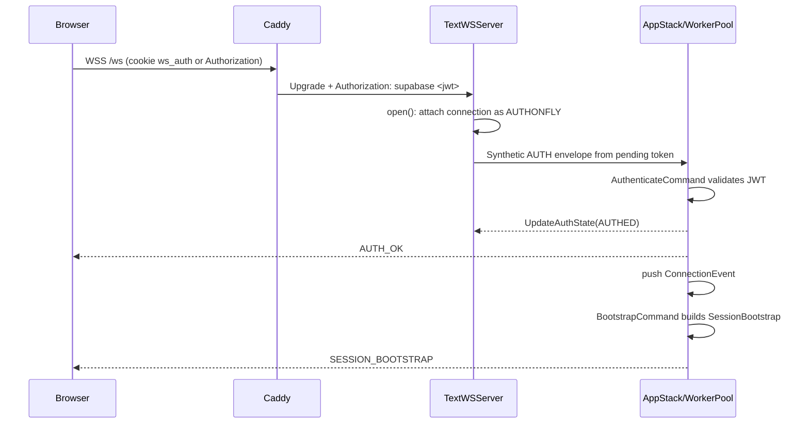

# System Overview

This document reflects the current implementation in `server/`, `app/`, `net/`, `control/`, `clients/web/`, and `docker/`.

## Runtime Topology

```mermaid
flowchart TB
    subgraph Clients
        WEB[Web Client\nNuxt app (:3000 via Caddy)]
        ADMIN[Admin Client\nNuxt app (:3001 direct)]
    end

    CADDY[Caddy TLS Entry\n:443]

    subgraph Backend
        SRV[Server]
        APP[AppStack]
        ROUTER[NetworkRouter]
        NS1[NetworkStack :9001]
        NS2[NetworkStack :9002]
        CTRL[HttpServer :8081]
    end

    subgraph External
        DB[(PostgreSQL)]
        REDIS[(Redis :6379)]
        LK1[LiveKit Node1 :7880]
        LK2[LiveKit Node2 :7890]
        SUPA[Supabase JWT verification]
    end

    WEB -->|HTTPS/WSS :443| CADDY

    CADDY -->|/ws*| NS1
    CADDY -->|/ws*| NS2
    CADDY -->|/livekit*| LK1
    CADDY -->|/livekit*| LK2
    CADDY -->|/*| WEB

    SRV --> APP
    SRV --> ROUTER
    SRV --> CTRL
    ROUTER --> NS1
    ROUTER --> NS2

    APP --> DB
    APP --> SUPA
    LK1 --> REDIS
    LK2 --> REDIS
```

In current dev scripts, the admin client is served directly on `:3001` (not through Caddy).

## Server Composition

`server::Server` owns:
1. `app::AppStack`
2. `net::NetworkRouter` with one or more `NetworkStack` instances
3. `control::http::HttpServer`

Start order (`server/Server.cpp`):
1. Initialize `EventLogger`
2. Build/register network stacks (`init_stacks()`)
3. `AppStack::bootstrap()`
4. `AppStack::start()`
5. Start metrics timeseries
6. `NetworkRouter::start_all()`
7. `HttpServer::start()`

Stop order:
1. `HttpServer::stop()`
2. `AppStack::stop()`
3. `NetworkRouter::stop_all()`
4. Stop metrics timeseries
5. Shutdown `EventLogger`

## Authentication + Bootstrap Flow



Notes:
- Session is created only after successful auth (`SessionManager::attachConnection`).
- Bootstrap is triggered by a queued `ConnectionEvent`, not directly in transport.
- Re-auth updates auth state and returns `AUTH_OK` without rebuilding session.

## Command Processing Path

```mermaid
flowchart LR
    IN[Inbound Envelope] --> EQ[EventQueue high/low]
    EQ --> WP[WorkerPool]
    WP --> PV[ProtoMessageValidator]
    PV --> DISP[Dispatcher]
    DISP --> CMD[Command handler]
    CMD --> OUT[OutgoingMessage intents]
    OUT --> ROUTER[NetworkRouter]
    ROUTER --> NS[Target NetworkStack]
    NS --> OQ[OutgoingQueue]
    OQ --> OW[OutgoingWorker]
    OW --> WS[WebSocket send / auth update / drop]
```



## Queueing and Priority Model

Inbound (`app::queue::EventQueue`):
- `High`: authoritative state events
- `Low`: ephemeral events (`TYPING`, `PRESENCE`, `VOICE_ACTIVITY`)
- If full, low-priority incoming events are dropped
- If full and a high-priority event arrives, low-priority entries may be evicted first

Outbound (`net::outbound::OutgoingQueue`):
- `High` and `Low` deques
- If full, low-priority outgoing events are dropped
- If full and a high-priority event arrives, low-priority entries may be evicted first

Per-connection outbox (`ConnectionContext::PerConnectionOutbox`):
- Capacity `128`
- On pressure: low drops first; repeated overflow can mark/drop slow connection queue

## Control Plane Endpoints

`control/http/HttpServer.cpp` exposes:
- `GET /health`
- `GET /metrics/snapshot`
- `GET /metrics/timeseries?window=<sec>`
- `GET /metrics/public`

Default bind: `127.0.0.1:8081` (overridable via `CONTROL_HOST`, `CONTROL_PORT`).

## Configuration Highlights

`core/ServerConfig.h` + `ServerConfigFiller::fill_from_env`:
- Socket ports: either `SOCKET_PORT=[p1,p2,...]` or single `SOCKET_PORT`
- If socket port list is provided, number of stacks == list size
- Else stacks == `socket_threads` (default `2`)
- Event queue capacity default `30000`
- Outbound queue capacity default `50000`
- Worker threads default `3`

## Current Protocol Surface

`proto/envelope.proto` currently includes:
- Session/auth: `AUTH`, `AUTH_OK`, `SESSION_BOOTSTRAP`, `CommandError`
- Heartbeat: `PING`, `PONG`
- Presence/activity: `PRESENCE`, `TYPING`, `ACTIVE_CHANNEL`, `VOICE_JOIN`, `VOICE_ACTIVITY`, voice events
- Messages: send/fetch + `MESSAGE_CREATED`/`MESSAGE_BATCH`
- Hubs/channels/users: create/update/remove and corresponding events
