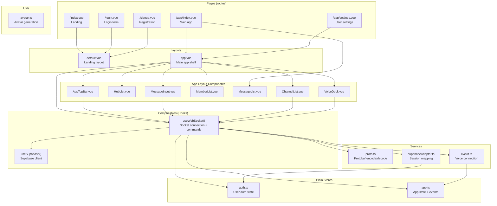
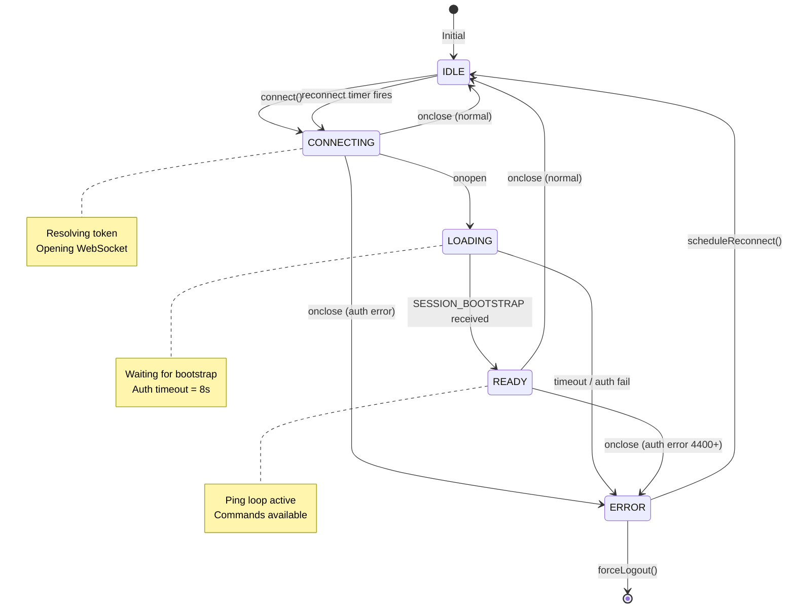
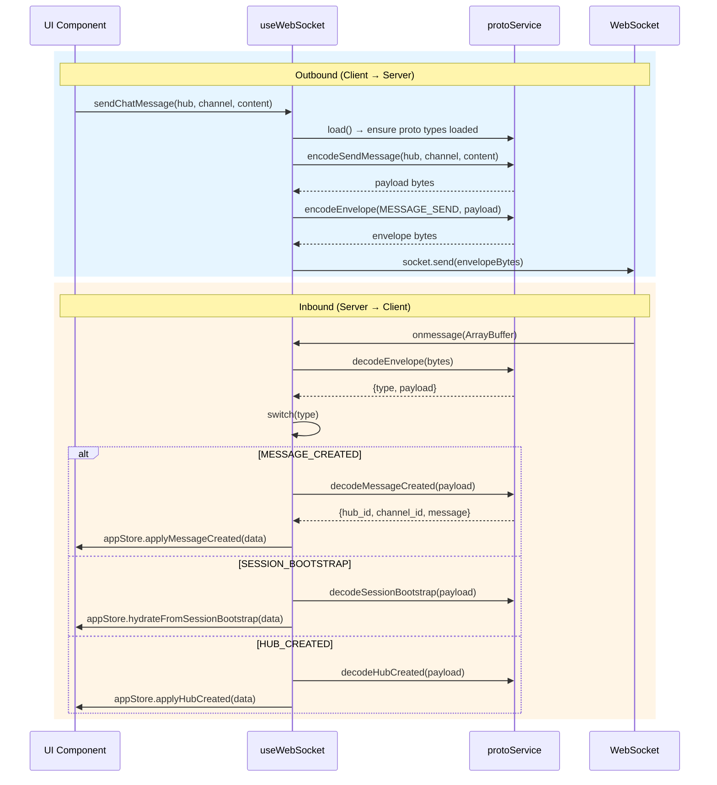
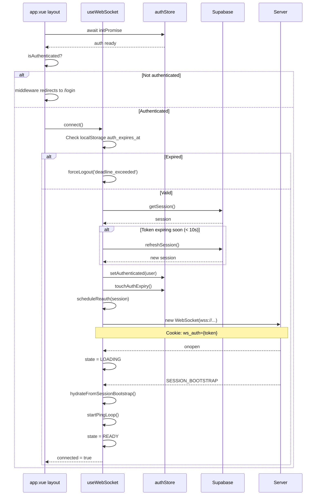
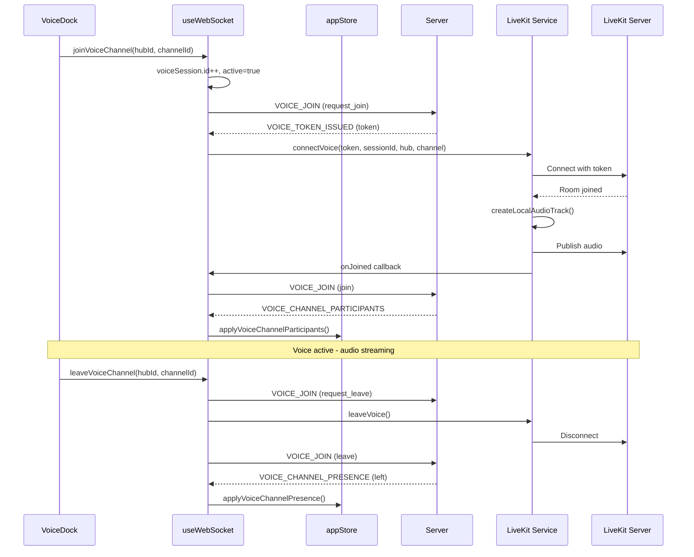
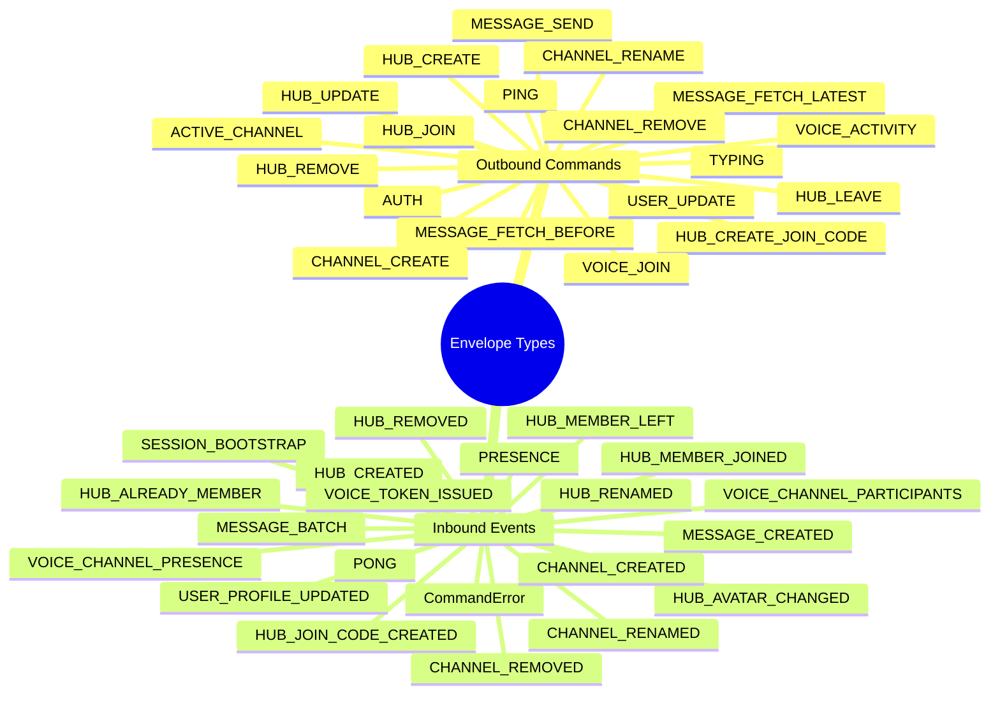
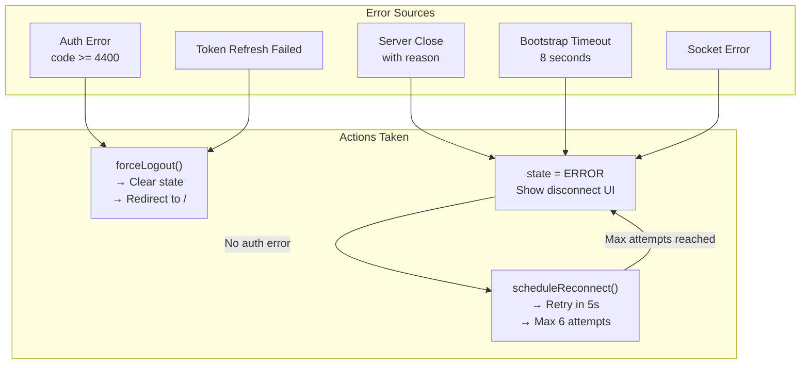
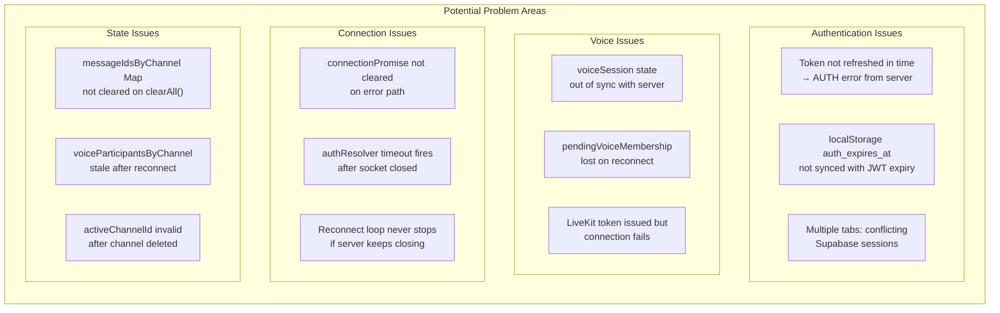

# Web Client Architecture

## Module Overview



## WebSocket State Machine



## useWebSocket Composable - Function Map

```mermaid
flowchart TB
    subgraph Connection["Connection Management"]
        CONNECT["connect(options)"]
        DISCONNECT["disconnect()"]
        RESOLVE_TOKEN["resolveToken()"]
        WAIT_AUTH["waitForAuth(timeout)"]
        schedule_reconnect["scheduleReconnect()"]
        FORCE_LOGOUT["forceLogout(reason)"]
    end

    subgraph Auth["Authentication"]
        SEND_REAUTH["sendReauth(token)"]
        REFRESH_REAUTH["refreshAndReauth()"]
        SCHEDULE_REAUTH["scheduleReauth(session)"]
        ENSURE_LISTENER["ensureAuthRefreshListener()"]
    end

    subgraph Heartbeat["Heartbeat"]
        SEND_PING["sendPing()"]
        START_PING["startPingLoop()"]
        STOP_PING["stopPingLoop()"]
    end

    subgraph Messages["Message Commands"]
        SEND_MSG["sendChatMessage(hub, channel, content)"]
        FETCH_LATEST["fetchLatestMessages(hub, channel)"]
        FETCH_BEFORE["fetchMessagesBefore(hub, channel, beforeId)"]
    end

    subgraph Hubs["Hub Commands"]
        CREATE_HUB["createHub(name)"]
        JOIN_HUB["joinHub(code)"]
        LEAVE_HUB["leaveHub(hubId)"]
        REMOVE_HUB["removeHub(hubId)"]
        UPDATE_HUB["updateHubSettings(hubId, changes)"]
        HUB_CODE["createHubJoinCode(hubId)"]
    end

    subgraph Channels["Channel Commands"]
        CREATE_CHAN["createChannel(hub, name, type)"]
        UPDATE_CHAN["updateChannelSettings(hub, channel, changes)"]
        REMOVE_CHAN["removeChannel(hub, channel)"]
        ACTIVE_CHAN["sendActiveChannel(hub, channel)"]
    end

    subgraph Activity["Activity Commands"]
        TYPING_START["sendTypingStarted(hub, channel)"]
        TYPING_STOP["sendTypingStopped(hub, channel)"]
    end

    subgraph Voice["Voice Commands"]
        JOIN_VOICE["joinVoiceChannel(hub, channel)"]
        LEAVE_VOICE["leaveVoiceChannel(hub, channel)"]
        VOICE_ACTIVITY["sendVoiceActivity(hub, channel, activity)"]
        CONNECT_VOICE["connectVoice(token, sessionId, hub, channel)"]
        DISCONNECT_VOICE["disconnectVoice()"]
        SEND_MEMBERSHIP["sendVoiceMembership(hub, channel, state)"]
        FINALIZE_LEAVE["finalizeVoiceLeave(...)"]
    end

    subgraph User["User Commands"]
        UPDATE_USER["updateUserSettings(changes)"]
    end

    subgraph Handlers["Message Handlers"]
        HANDLE_MSG["handleMessage(event)"]
        HANDLE_BIN["handleBinaryMessage(data)"]
        HANDLE_TXT["handleTextMessage(data)"]
    end

    CONNECT --> RESOLVE_TOKEN
    CONNECT --> WAIT_AUTH
    RESOLVE_TOKEN --> SEND_REAUTH
    WAIT_AUTH --> START_PING

    HANDLE_MSG --> HANDLE_BIN
    HANDLE_MSG --> HANDLE_TXT
```



## Protobuf Message Flow



## App Store - State & Event Handlers

```mermaid
flowchart TB
    subgraph State["Reactive State"]
        direction LR
        HUBS["hubs[]"]
        CHANNELS["channelsByHub{}"]
        MEMBERS["membersByHub{}"]
        MESSAGES["messagesByChannel{}"]
        PRESENCE["presenceByUser{}"]
        TYPING["typingByChannel{}"]
        VOICE_PART["voiceParticipantsByChannel{}"]
        VOICE_STATE["voiceStatesByUser{}"]
    end

    subgraph Identity["User Identity"]
        USER_ID["userId"]
        USERNAME["username"]
        DISPLAY["displayName"]
        AVATAR["avatarSeed"]
    end

    subgraph Selection["UI Selection"]
        ACTIVE_HUB["activeHubId"]
        ACTIVE_CHAN["activeChannelId"]
        ACTIVE_VOICE_HUB["activeVoiceHubId"]
        ACTIVE_VOICE_CHAN["activeVoiceChannelId"]
        VIEWED_HUB["viewedHubId"]
    end

    subgraph Handlers["Event Handlers (apply*)"]
        H_BOOTSTRAP["hydrateFromSessionBootstrap()"]
        H_PRESENCE["applyPresenceEvent()"]
        H_MSG_CREATE["applyMessageCreated()"]
        H_MSG_BATCH["applyMessageBatch()"]
        H_HUB_CREATE["applyHubCreated()"]
        H_HUB_REMOVE["applyHubRemoved()"]
        H_HUB_RENAME["applyHubRenamed()"]
        H_MEMBER_JOIN["applyHubMemberJoined()"]
        H_MEMBER_LEFT["applyHubMemberLeft()"]
        H_CHAN_CREATE["applyChannelCreated()"]
        H_CHAN_REMOVE["applyChannelRemoved()"]
        H_CHAN_RENAME["applyChannelRenamed()"]
        H_VOICE_PART["applyVoiceChannelParticipants()"]
        H_VOICE_PRES["applyVoiceChannelPresence()"]
        H_USER_UPDATE["applyUserProfileUpdated()"]
    end

    H_BOOTSTRAP --> HUBS
    H_BOOTSTRAP --> CHANNELS
    H_BOOTSTRAP --> MEMBERS
    H_BOOTSTRAP --> PRESENCE

    H_PRESENCE --> PRESENCE
    H_PRESENCE --> TYPING

    H_MSG_CREATE --> MESSAGES
    H_MSG_BATCH --> MESSAGES

    H_HUB_CREATE --> HUBS
    H_HUB_CREATE --> CHANNELS
    H_HUB_REMOVE --> HUBS
    H_HUB_REMOVE --> ACTIVE_HUB
    H_HUB_RENAME --> HUBS

    H_MEMBER_JOIN --> MEMBERS
    H_MEMBER_JOIN --> PRESENCE
    H_MEMBER_LEFT --> MEMBERS

    H_CHAN_CREATE --> CHANNELS
    H_CHAN_REMOVE --> CHANNELS
    H_CHAN_REMOVE --> ACTIVE_CHAN
    H_CHAN_RENAME --> CHANNELS

    H_VOICE_PART --> VOICE_PART
    H_VOICE_PRES --> VOICE_PART
    H_VOICE_PRES --> VOICE_STATE
```



## Connection & Auth Flow



## Voice Channel Flow



## Envelope Types (Commands & Events)



## Error Handling & Reconnection



## Potential Issue Points



## File Structure Summary

| Path | Purpose | Key Functions |
|------|---------|---------------|
| `composables/useWebSocket.ts` | WebSocket singleton, all commands | connect, disconnect, send*, fetch*, join*, leave* |
| `composables/useSupabase.ts` | Supabase client singleton | createClient |
| `stores/auth.ts` | Auth state | setAuthenticated, logout, touchAuthExpiry |
| `stores/app.ts` | App state + event handlers | hydrate*, apply*, activate*, view* |
| `src/services/proto.ts` | Protobuf encode/decode | load, encode*, decode* |
| `src/services/voice/livekit.ts` | LiveKit voice | connectVoice, leaveVoice |
| `src/services/auth/supabaseAdapter.ts` | Session mapping | mapSupabaseSession |
| `layouts/app.vue` | Main app shell | Boot screen, disconnect handling |
| `layouts/app/MessageList.vue` | Chat messages | Render, scroll, fetch more |
| `layouts/app/MessageInput.vue` | Message input | Typing indicators, send |
| `layouts/app/VoiceDock.vue` | Voice controls | Join, leave, mute, deafen |
| `layouts/app/HubList.vue` | Hub sidebar | Select, create, join hub |
| `layouts/app/ChannelList.vue` | Channel list | Select channel, create |
| `layouts/app/MemberList.vue` | Member list | Online status |

## Data Flow Summary

```
┌─────────────────────────────────────────────────────────────────────┐
│  UI LAYER (Vue Components)                                          │
│  ┌─────────────┐  ┌─────────────┐  ┌─────────────┐                  │
│  │  HubList    │  │ ChannelList │  │ MessageList │  ...             │
│  └──────┬──────┘  └──────┬──────┘  └──────┬──────┘                  │
│         │                │                │                          │
│         ▼                ▼                ▼                          │
└─────────────────────────────────────────────────────────────────────┘
                              │
                              │ useWebSocket() + useAppStore()
                              ▼
┌─────────────────────────────────────────────────────────────────────┐
│  STATE LAYER (Pinia Stores)                                         │
│  ┌───────────────────────┐  ┌───────────────────────────────────┐  │
│  │  authStore            │  │  appStore                         │  │
│  │  - authenticated      │  │  - hubs, channels, members        │  │
│  │  - user               │  │  - messages, presence, typing     │  │
│  │  - bootPhase          │  │  - voice participants/states      │  │
│  └───────────────────────┘  └───────────────────────────────────┘  │
└─────────────────────────────────────────────────────────────────────┘
                              │
                              │ Commands (send) / Events (receive)
                              ▼
┌─────────────────────────────────────────────────────────────────────┐
│  COMPOSABLE LAYER                                                   │
│  ┌───────────────────────────────────────────────────────────────┐  │
│  │  useWebSocket (singleton)                                      │  │
│  │  - state: IDLE → CONNECTING → LOADING → READY                 │  │
│  │  - ping loop, reauth scheduler, reconnect logic               │  │
│  └───────────────────────────────────────────────────────────────┘  │
└─────────────────────────────────────────────────────────────────────┘
                              │
                              │ Binary (protobuf)
                              ▼
┌─────────────────────────────────────────────────────────────────────┐
│  SERVICE LAYER                                                      │
│  ┌─────────────────┐  ┌─────────────────┐  ┌─────────────────────┐ │
│  │  protoService   │  │  livekit.ts     │  │  supabaseAdapter    │ │
│  │  encode/decode  │  │  voice connect  │  │  session mapping    │ │
│  └─────────────────┘  └─────────────────┘  └─────────────────────┘ │
└─────────────────────────────────────────────────────────────────────┘
                              │
                              │ WebSocket / WebRTC
                              ▼
┌─────────────────────────────────────────────────────────────────────┐
│  NETWORK                                                            │
│  ┌─────────────────────┐  ┌─────────────────────────────────────┐  │
│  │  WebSocket → Server │  │  LiveKit Client → LiveKit Server    │  │
│  │  wss://.../ws       │  │  Voice/WebRTC                       │  │
│  └─────────────────────┘  └─────────────────────────────────────┘  │
└─────────────────────────────────────────────────────────────────────┘
```
