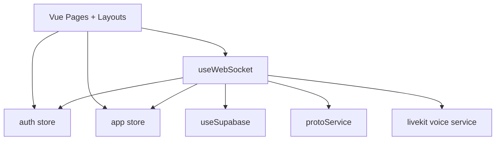

# Web Client Architecture

This document reflects current code in `clients/web/`.

## Route and Layout Structure

Routes in `clients/web/pages/`:
- `/` (`index.vue`)
- `/login` (`login.vue`)
- `/signup` (`signup.vue`)
- `/reset-password` (`reset-password.vue`)
- `/app` (`app/index.vue`)
- `/app/settings` (`app/settings.vue`)
- fallback (`[...all].vue`)

Layouts:
- `layouts/default.vue` for public pages
- `layouts/app.vue` for authenticated app shell

## Main App Shell (`layouts/app.vue`)

Primary regions:
- top bar (`AppTopBar.vue`)
- hub list (`HubList.vue`)
- channel list (`ChannelList.vue`)
- member list (`MemberList.vue`)
- message input (`MessageInput.vue`)
- voice dock (`VoiceDock.vue`)

`onMounted` behavior:
- waits for auth init promise
- calls `socket.connect()` when authenticated and socket is idle/error

## Frontend Module Graph

## Auth Bootstrapping

`plugins/auth-init.client.ts`:
1. checks app-level expiry in `localStorage`
2. tries `supabase.auth.getSession()`
3. hydrates `auth` store if valid
4. marks store ready and resolves init promise

Route protection:
- `middleware/auth.global.ts` gates `/app*` and redirects unauthenticated users.
- Middleware waits for `auth.initPromise` to avoid startup race.

## WebSocket State Machine

From `composables/useWebSocket.ts`:
- Socket states: `IDLE`, `CONNECTING`, `LOADING`, `READY`, `ERROR`
- Auth states: `UNAUTHENTICATED`, `AUTHENTICATED`

Connection flow:
1. resolve/refresh Supabase token
2. set `ws_auth` cookie (browser path)
3. open `wss://<host>/ws` (or validated override)
4. wait for `AUTH_OK`
5. wait for `SESSION_BOOTSTRAP`
6. mark `READY` and start ping loop

Re-auth flow:
- schedules refresh ~30s before session expiry
- sends `AUTH` reauth envelope
- expects `AUTH_OK` (no re-bootstrap)

Reconnect policy:
- retries only when close is non-auth and without explicit server reason
- backoff is fixed 5s, up to 6 attempts

## Protobuf/Envelope Handling

`src/services/proto.ts` loads all protocol files and provides:
- envelope encode/decode
- command encoders (auth, hubs, channels, messages, voice, user)
- event decoders (bootstrap, presence, message, hub/channel/user/voice updates)

Heartbeat:
- client sends app-level `PING` every 1s
- processes `PONG` and smooths RTT with median+EMA window

## App Store Responsibilities (`stores/app.ts`)

Authoritative state:
- hubs/channels/members
- presence and typing state
- messages and pagination exhaustion
- voice participants and voice states
- command error map

Identity:
- `userId`, `username`, `displayName`, `avatarSeed`

Voice UI state:
- active voice hub/channel
- muted/deafened flags
- connection state + latency + errors

Primary reducers used by websocket handler:
- `hydrateFromSessionBootstrap`
- `mergeSessionBootstrap`
- `applyPresenceEvent`
- `applyMessageCreated`
- `applyMessageBatch`
- `applyHub*` and `applyChannel*`
- `applyUserProfileUpdated`
- `applyVoiceChannelParticipants`
- `applyVoiceChannelPresence`

## Outbound Commands from `useWebSocket`

- Auth/session: `AUTH` (initial and reauth)
- Activity: `TYPING`, `ACTIVE_CHANNEL`, `VOICE_ACTIVITY`
- Voice membership: `VOICE_JOIN` with `request_join/request_leave/join/leave`
- Messaging: `MESSAGE_SEND`, `MESSAGE_FETCH_LATEST`, `MESSAGE_FETCH_BEFORE`
- Hub: `HUB_CREATE`, `HUB_JOIN`, `HUB_CREATE_JOIN_CODE`, `HUB_LEAVE`, `HUB_REMOVE`, `HUB_UPDATE`
- Channel: `CHANNEL_CREATE`, `CHANNEL_RENAME`, `CHANNEL_REMOVE`
- User: `USER_UPDATE`

## Inbound Envelopes Handled

- Session/auth: `AUTH_OK`, `SESSION_BOOTSTRAP`, `CommandError`
- Heartbeat: `PONG`
- Presence/activity: `PRESENCE`, voice participant/presence events
- Messages: `MESSAGE_CREATED`, `MESSAGE_BATCH`
- Hub/channel/user events: created/renamed/removed/update variants
- Voice token: `VOICE_TOKEN_ISSUED`

## Voice Integration (`src/services/voice/livekit.ts`)

Join flow:
1. websocket sends `VOICE_JOIN` `request_join`
2. server emits `VOICE_TOKEN_ISSUED` (+ optional E2EE key)
3. `livekit.connectVoice()` connects room and publishes local mic track
4. `onJoined` callback sends websocket `VOICE_JOIN` `join`

Leave flow:
1. websocket sends `request_leave`
2. disconnect LiveKit room
3. websocket sends `leave`
4. store clears active voice state

Voice service features:
- retry loop with capped attempts
- disconnect classification for permanent vs recoverable failures
- live RTT sampling from RTC stats into `appStore.voiceLatencyMs`
- local mute/deafen controls used by `VoiceDock.vue`
