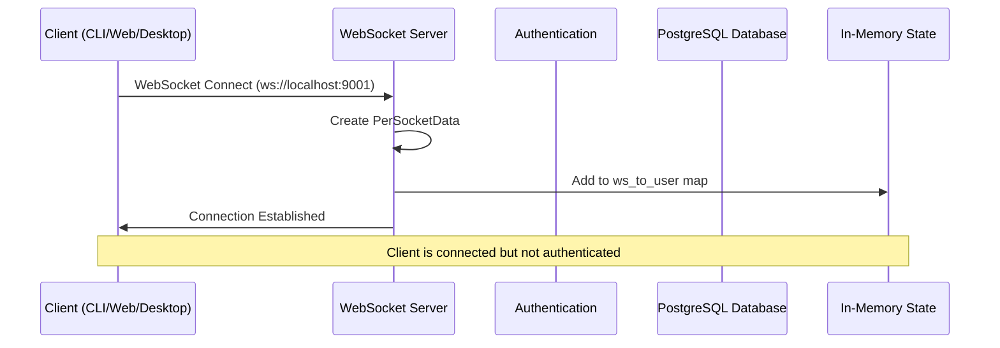
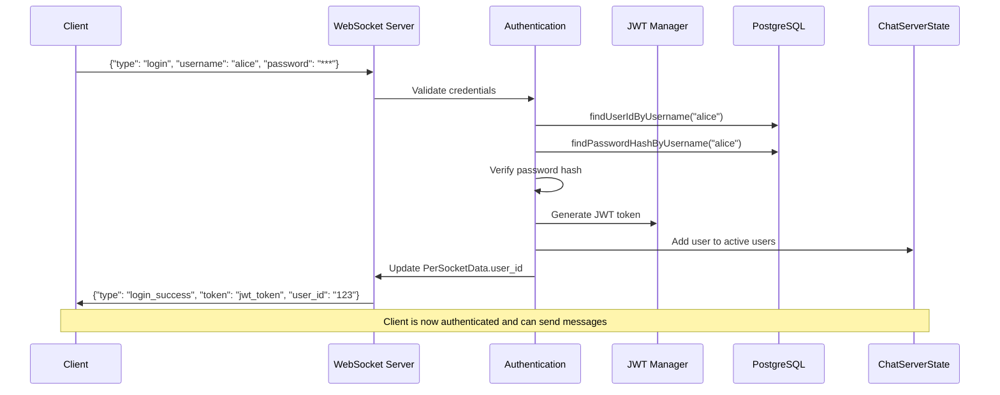
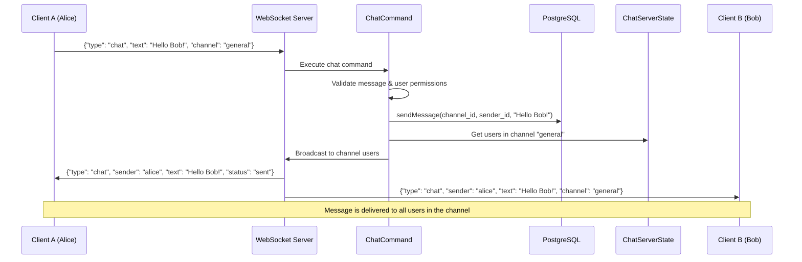
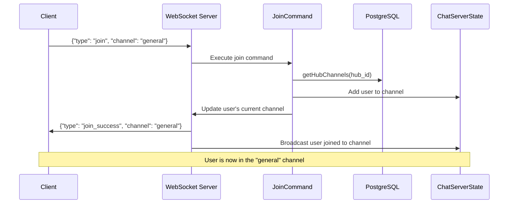
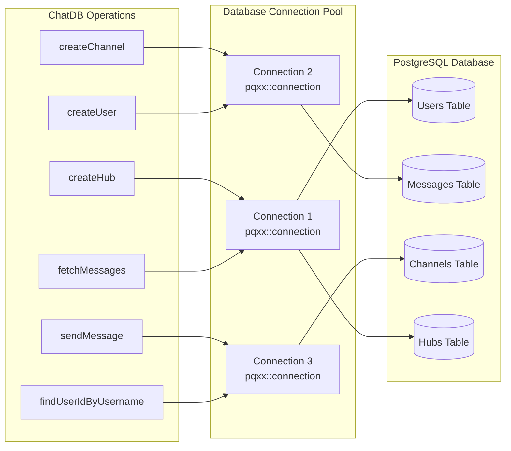

# Serverless Communication Platform - Communication Flow Diagram

## High-Level Architecture Overview

```mermaid
graph TB
    subgraph ClientLayer["Client Layer"]
        CLI[CLI Client<br/>websocketpp]
        WEB[Web Client<br/>JavaScript]
        DESKTOP[Desktop Client<br/>Qt/C++]
        MOBILE[Mobile Client<br/>iOS/Android]
    end
    
    subgraph NetworkLayer["Network Layer"]
        WS[WebSocket Connection<br/>ws://localhost:9001]
        WSS[Secure WebSocket<br/>wss:// planned]
    end
    
    subgraph ServerLayer["Server Layer"]
        subgraph ChatServerApp["ChatServerApp"]
            WS_SERVER[uWebSockets Server]
            COMMAND_HANDLER[Command Handler<br/>Pattern]
            AUTH[Authentication<br/>JWT + HMAC]
            RATE_LIMITER[Rate Limiter]
            SESSION_MGR[Session Manager]
        end
        
        subgraph CommandSystem["Command System"]
            LOGIN[LoginCommand]
            REGISTER[RegisterCommand]
            AUTH_CMD[AuthenticateCommand]
            CHAT[ChatCommand]
            JOIN[JoinCommand]
            USERS[UsersCommand]
            PING[PingCommand]
        end
    end
    
    subgraph DataLayer["Data Layer"]
        subgraph ChatDB["ChatDB PostgreSQL"]
            USERS_TABLE[Users Table]
            MESSAGES_TABLE[Messages Table]
            CHANNELS_TABLE[Channels Table]
            HUBS_TABLE[Hubs Table]
        end
        
        subgraph InMemoryState["In-Memory State"]
            CHAT_STATE[ChatServerState<br/>Active Users & Channels]
            WS_CONNECTIONS[WebSocket Connections<br/>ws_to_user Map]
        end
    end
    
    subgraph SecurityLayer["Security Layer"]
        JWT_MGR[JWT Manager]
        HMAC_VAL[HMAC Validator]
        MSG_ENCRYPT[Message Encryption]
        SECURITY_VAL[Security Validator]
    end
    
    %% Client connections
    CLI --> WS
    WEB --> WS
    DESKTOP --> WS
    MOBILE --> WS
    
    %% Network to server
    WS --> WS_SERVER
    WSS --> WS_SERVER
    
    %% Server internal flow
    WS_SERVER --> COMMAND_HANDLER
    COMMAND_HANDLER --> AUTH
    AUTH --> RATE_LIMITER
    RATE_LIMITER --> SESSION_MGR
    
    %% Command routing
    COMMAND_HANDLER --> LOGIN
    COMMAND_HANDLER --> REGISTER
    COMMAND_HANDLER --> AUTH_CMD
    COMMAND_HANDLER --> CHAT
    COMMAND_HANDLER --> JOIN
    COMMAND_HANDLER --> USERS
    COMMAND_HANDLER --> PING
    
    %% Database connections
    LOGIN --> USERS_TABLE
    REGISTER --> USERS_TABLE
    AUTH_CMD --> USERS_TABLE
    CHAT --> MESSAGES_TABLE
    JOIN --> CHANNELS_TABLE
    USERS --> USERS_TABLE
    
    %% In-memory state
    CHAT --> CHAT_STATE
    JOIN --> CHAT_STATE
    USERS --> CHAT_STATE
    WS_SERVER --> WS_CONNECTIONS
    
    %% Security integration
    AUTH --> JWT_MGR
    AUTH --> HMAC_VAL
    CHAT --> MSG_ENCRYPT
    COMMAND_HANDLER --> SECURITY_VAL
```

## Detailed Communication Flow

### 1. Connection Establishment

### 2. Authentication Flow

### 3. Chat Message Flow

### 4. Channel Management Flow

### 5. Database Connection Management

## Key Communication Patterns

### 1. **Command Pattern Implementation**
- Each client request is routed to a specific `ICommand` implementation
- Commands handle authentication, validation, and business logic
- Commands interact with both database and in-memory state

### 2. **WebSocket Connection Management**
- Server maintains `ws_to_user` map for connection tracking
- `PerSocketData` stores user context per connection
- Connection events trigger state updates

### 3. **Message Routing**
- Messages are routed based on `type` field in JSON
- Channel-based broadcasting for chat messages
- Direct messaging for system notifications

### 4. **Security Flow**
- JWT tokens for session management
- HMAC signatures for message integrity
- Rate limiting per connection
- Input validation and sanitization

### 5. **Database Operations**
- PostgreSQL for persistent storage
- Connection pooling via pqxx
- Transaction management for data consistency
- Prepared statements for security

## Current Implementation Status

✅ **Implemented:**
- Basic WebSocket communication
- Command pattern architecture
- PostgreSQL database integration
- User authentication system
- Chat message routing
- Channel management

🔄 **In Progress:**
- Security enhancements (JWT, HMAC, WSS)
- Rate limiting implementation
- Message encryption
- Session management

📋 **Planned:**
- WebRTC signaling for voice/video calls
- TURN server integration
- SFU for multi-user calls
- Mobile client support

This architecture provides a solid foundation for real-time communication with clear separation of concerns and extensible design patterns. 