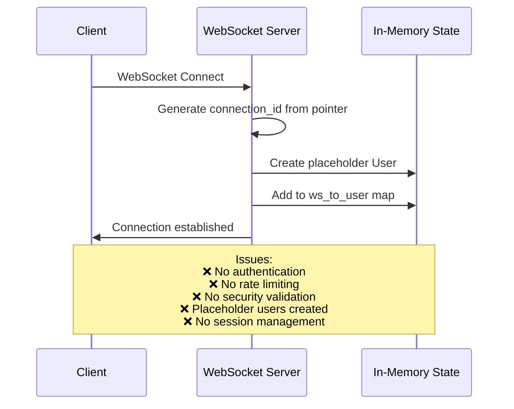
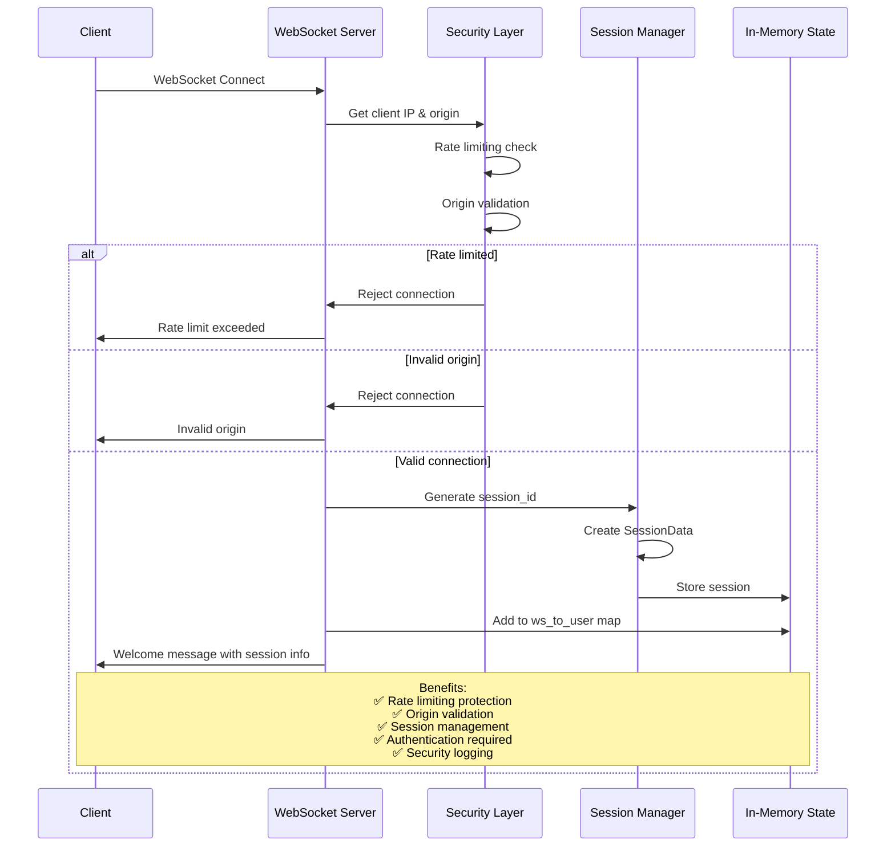
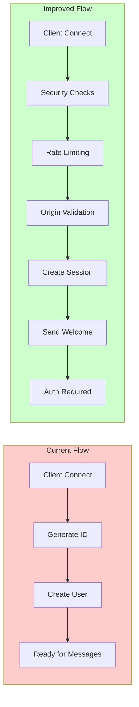

# Connection Handling: Current vs Improved

## Current Connection Flow

## Improved Connection Flow

## Key Improvements Summary

### 🔒 **Security Enhancements**

| Feature | Current | Improved |
|---------|---------|----------|
| **Rate Limiting** | ❌ None | ✅ 5 attempts per minute per IP |
| **Origin Validation** | ❌ None | ✅ Configurable allowed origins |
| **Session Management** | ❌ None | ✅ Unique session IDs with timeout |
| **Authentication Check** | ❌ None | ✅ Required for protected commands |
| **Security Logging** | ❌ Basic | ✅ Detailed security events |

### 🏗️ **Architecture Improvements**

| Component | Current | Improved |
|-----------|---------|----------|
| **Connection ID** | Pointer address | Cryptographically secure session ID |
| **User Creation** | Immediate placeholder | On-demand with authentication |
| **Error Handling** | Basic | Structured error responses with codes |
| **Session Tracking** | None | Full session lifecycle management |
| **Client Info** | None | IP, origin, and activity tracking |

### 📊 **Data Flow Comparison**

### 🚀 **Benefits of Improved Approach**

1. **Security First**: Multiple layers of protection before accepting connections
2. **Session Management**: Proper session tracking with timeouts and cleanup
3. **Rate Limiting**: Protection against connection spam and DoS attacks
4. **Origin Validation**: CSRF protection for web clients
5. **Structured Errors**: Clear error messages with error codes
6. **Activity Tracking**: Monitor user activity and session health
7. **Scalable Design**: Easy to add more security layers

### 🔧 **Implementation Notes**

The improved version adds these key components:

- **ConnectionAttempt**: Tracks connection attempts per IP
- **SessionData**: Manages session state and authentication
- **Security validation**: Origin and rate limiting checks
- **Structured error responses**: Consistent error format
- **Session cleanup**: Automatic cleanup of expired sessions

This creates a much more robust and secure foundation for the communication platform! 