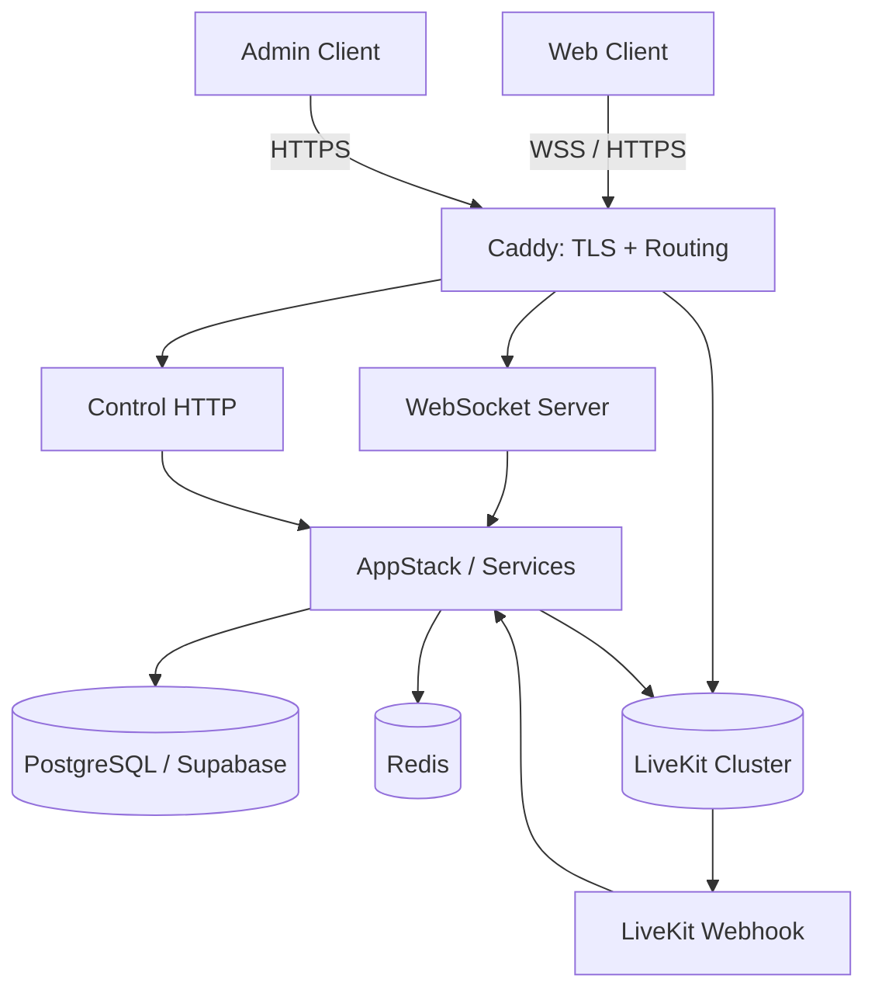
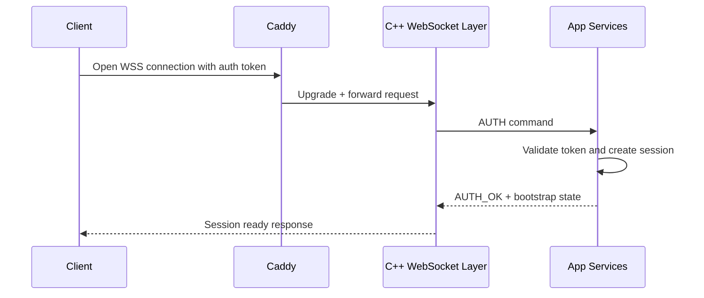
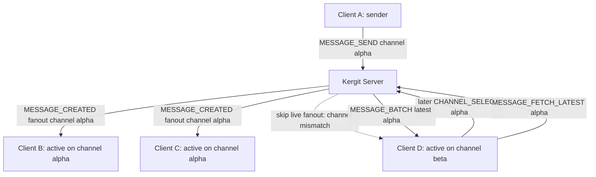
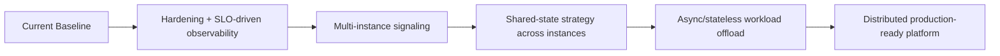

# Architecture

This document gives a high-level view of the Kergit runtime architecture.

Kergit is a real-time communication platform built around a C++ signaling core, protobuf-based protocol contracts, WebSocket transport, PostgreSQL-backed durable state, Redis-backed ephemeral coordination, and LiveKit-based media.

The signaling server remains authoritative for application state and voice ownership. LiveKit is used as the media plane, but joining voice, selecting a node, minting tokens, handling reconnects, and reconciling webhook events are controlled by the Kergit backend.

## Runtime Layout

The backend is split into several runtime areas:

- `server/` starts the process and owns lifecycle.
- `app/` contains commands, services, managers, dispatching, and worker logic.
- `net/` owns WebSocket transport and connection routing.
- `control/` serves health and metrics endpoints.
- `infra/` wraps PostgreSQL/Supabase, Redis, and JWT verification.
- `livekit/` handles LiveKit token generation, webhook handling, and node selection.

`server/main.cpp` loads environment variables, builds the server configuration, and starts the server runtime. The server wires together the application stack, WebSocket routing, control HTTP endpoints, database/Redis integration, and LiveKit integration.

## High-Level System Diagram



## Clients

`clients/web/` is the main Nuxt 4 / Vue 3 client.

The normal client flow is:

1. The browser authenticates through the existing auth path.
2. The client opens a WebSocket session.
3. The server validates the session and replies with bootstrap state.
4. Later state changes arrive as deltas or real-time events.
5. Voice control remains server-authoritative even though media is handled by LiveKit.

The client does not directly decide voice ownership or voice permission. It asks the backend to join voice, and the backend decides whether the request is valid, which LiveKit node should be used, and what token should be minted.

## Connection, Auth, and Ready Flow



A connection starts in an unauthenticated state. The server expects the client to authenticate within a bounded time window. If authentication does not complete, the connection is closed.

After authentication succeeds, the backend creates a session and sends the initial state required by the client. From that point on, commands from the client are handled through the application command path, and server-side changes are returned as events, state deltas, or protocol-specific responses.

## Protocol and State Model

The shared protocol contract lives under `proto/`.

The protocol uses protobuf messages carried inside an envelope. The envelope gives the transport a stable outer shape while allowing the actual command or event payload to evolve independently.

Simplified shape:

```proto
syntax = "proto3";

package kergit.protocol;

message Envelope {
  uint32 version = 1;
  Type type = 3;
  bytes payload = 100;
}
```

The protocol separates durable state changes from transient signals.

Examples:

- `AUTH` / `AUTH_OK` handle session bootstrap.
- `STATE_SYNC` sends authoritative snapshots.
- `STATE_DELTA` sends durable mutations.
- `RT_SIGNAL` carries ephemeral presence or typing signals.
- Voice-specific messages handle join, leave, revoke, and self-status updates.

This split matters because not all real-time messages have the same recovery behavior. Durable state can be repaired by fetching or resyncing. Ephemeral signals such as typing or short-lived presence updates do not need the same persistence model.

## Command and Event Path

Incoming client messages are decoded, validated, and turned into application commands. Commands are processed by the application layer, which produces state changes, outgoing events, or direct responses.

```mermaid
flowchart LR
    IN[Incoming Envelope]
    IN --> V[Decode + Validate]
    V --> EQ[Priority Event Queue]
    EQ --> W[Worker Threads]
    W --> D[Dispatcher]
    D --> O[Outgoing Intents]
    O --> OQ[Priority Outgoing Queue]
    OQ --> OW[Outgoing Worker]
    OW --> PC[Per-Connection Outbox]
    PC --> OUT[Socket Write]
```



The backend uses explicit queues between transport and application processing. This keeps socket I/O, command execution, and outgoing fanout separated. It also makes backpressure behavior explicit instead of letting slow clients or bursty workloads block unrelated work.

## Backpressure and Slow-Consumer Isolation

Real-time systems need predictable behavior under load. Kergit uses priority-aware queues and per-connection output buffering so that slow consumers can be isolated.

The intended policy is:

```cpp
if (queue.full()) {
    if (msg.is_low_priority()) {
        drop_low_priority_message();
    } else {
        evict_low_priority_or_reject();
    }
}

if (conn.auth_pending_too_long()) {
    disconnect("auth_timeout");
}

if (conn.auth_expired()) {
    disconnect("auth_token_expired");
}
```

The goal is not to preserve every transient event at all costs. The goal is to preserve correctness for durable state while allowing low-priority or repairable real-time signals to be dropped during pressure.

For example, losing a typing indicator is acceptable. Losing an authoritative state mutation is not.

## Multi-Client Messaging Flow



Flow summary:

1. Client A sends a message to channel `alpha`.
2. The server validates and stores the message.
3. The server fans out the real-time message event to clients currently focused on channel `alpha`.
4. Client D is focused on another channel, so it does not receive the live fanout.
5. When Client D later selects channel `alpha`, it fetches the latest messages and catches up.

This avoids unnecessary fanout to clients that are not currently viewing the affected channel, while still allowing them to recover state when they switch context.

## Voice Ownership

Voice is session-owned, not only user-owned.

This is important because a single user may have multiple active sessions: for example, one browser tab, another browser tab, or a reconnecting client after a network interruption.

The backend enforces the following model:

- A user may have multiple sessions.
- Only one session owns the active voice connection for a channel.
- A re-authenticated session may request voice resume.
- A resumed session can revoke the previous owner session.
- LiveKit webhook events are reconciled back into server state.

This avoids many multi-device and reconnect bugs. The cost is that the backend must coordinate voice ownership explicitly instead of treating LiveKit membership as the only source of truth.

## LiveKit Role

LiveKit is the media plane.

Kergit still decides:

- who may join voice,
- which LiveKit node and URL should be used,
- which session owns the voice connection,
- when a token should be minted,
- what permissions the token should contain,
- how webhook events affect server-side state.

The client receives a LiveKit token from the backend only after the backend has accepted the voice join request.

## Redis Role

Redis is used for short-lived coordination state.

Examples include:

- invite links,
- pending voice join intents,
- short-lived voice/session helpers,
- other ephemeral coordination data.

Redis is not the durable system of record. Data that must survive long-term belongs in PostgreSQL.

## PostgreSQL / Supabase Role

PostgreSQL is the durable store.

Supabase currently provides:

- authentication/JWT infrastructure,
- PostgreSQL hosting model,
- storage integration for attachments,
- application data persistence.

The backend validates client identity using the configured auth/JWT path and then applies its own server-side authorization rules for application actions.

## Control and Observability

The control plane exposes health and metrics endpoints. These are intended for operational use and should remain protected in production deployments.

The system is designed to make important runtime behavior observable:

- connection lifecycle,
- authentication failures,
- queue pressure,
- dropped or rejected messages,
- voice ownership changes,
- LiveKit webhook reconciliation,
- Redis/database availability,
- health and readiness state.

## Deployment Shape

The current deployment is containerized and typically includes:

- Caddy as the edge proxy,
- the C++ signaling server,
- PostgreSQL/Supabase integration,
- Redis,
- LiveKit,
- the web client.

Caddy handles TLS and routing. The signaling server handles application protocol and state. LiveKit handles media transport.

## Scaling Direction

The current architecture is intended to evolve toward horizontally scalable signaling.



Near-term engineering goals:

1. Improve deployment hardening and operational dashboards.
2. Expand horizontal scaling for the signaling tier.
3. Keep low-latency socket gateways state-aware and efficient.
4. Move stateless async work out of the critical real-time path where appropriate.

## Notes

- Some internal protocol and build identifiers may remain legacy for compatibility.
- The control plane should not be exposed publicly without access control.
- Redis should be treated as ephemeral coordination storage, not as the source of truth.
- LiveKit membership should be reconciled with server-side voice ownership, not blindly trusted as application state.
- No major architecture rewrite is planned as part of the initial open-source cleanup.
