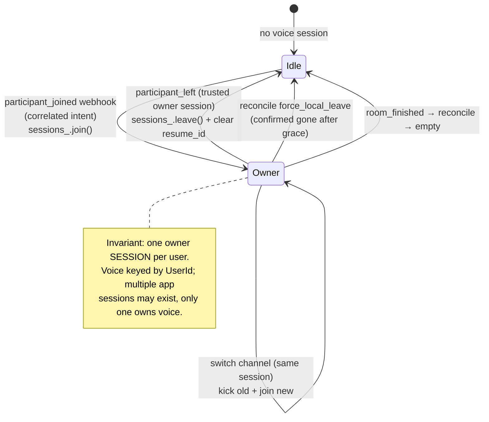
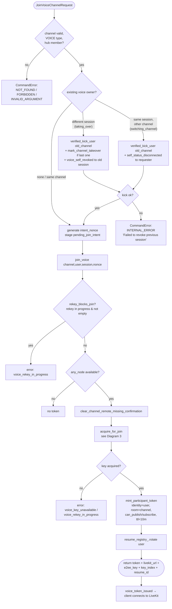
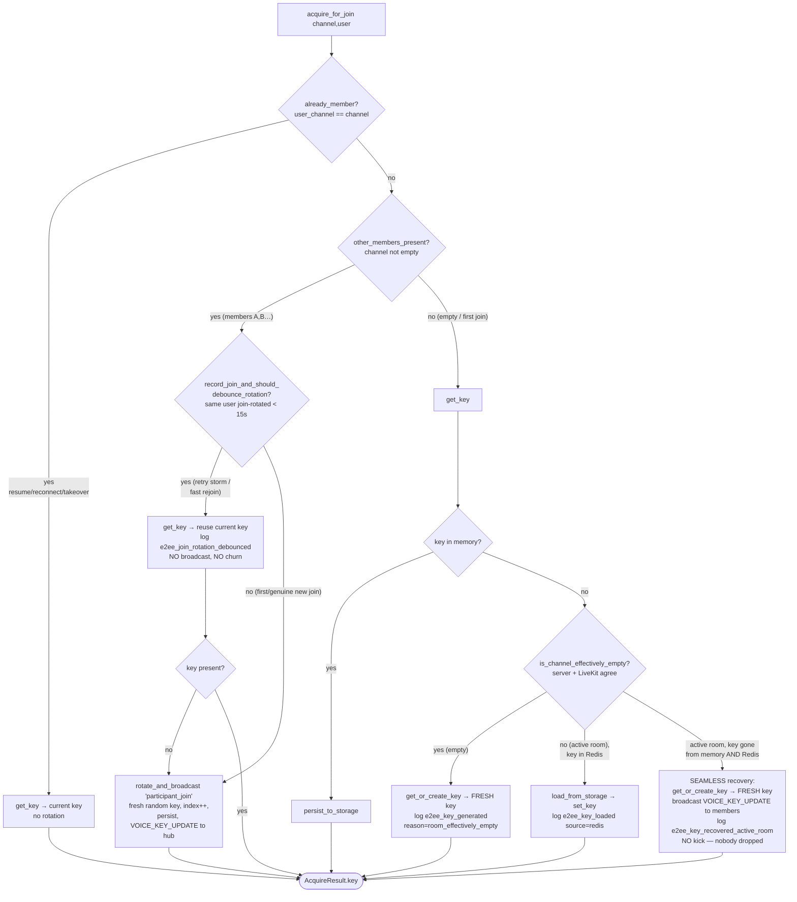
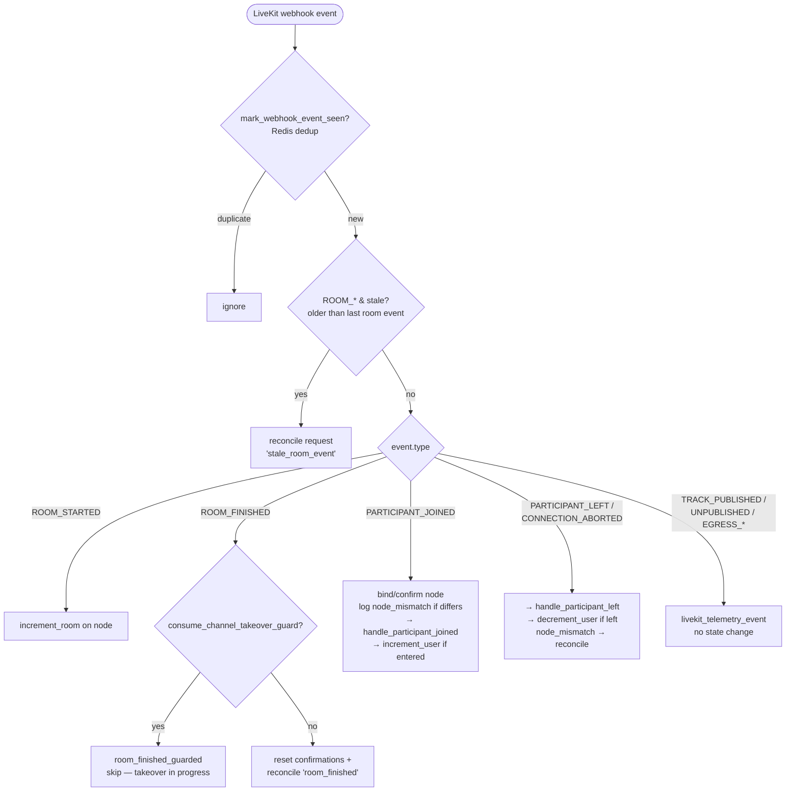
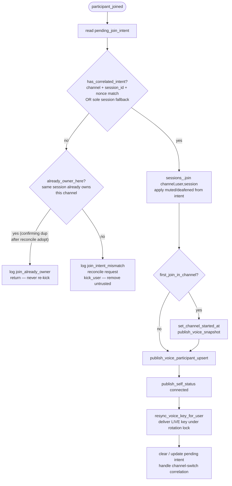
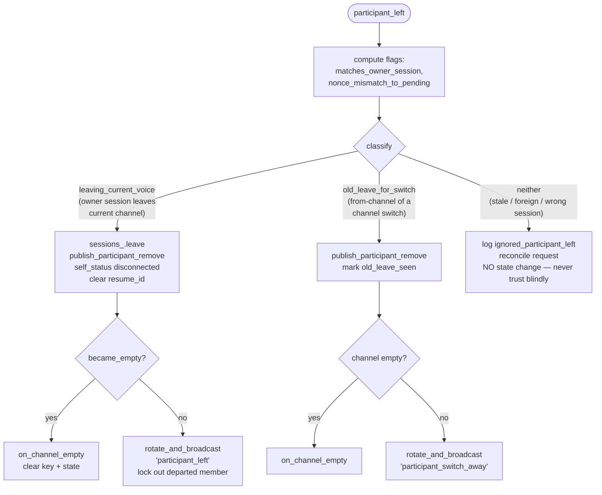
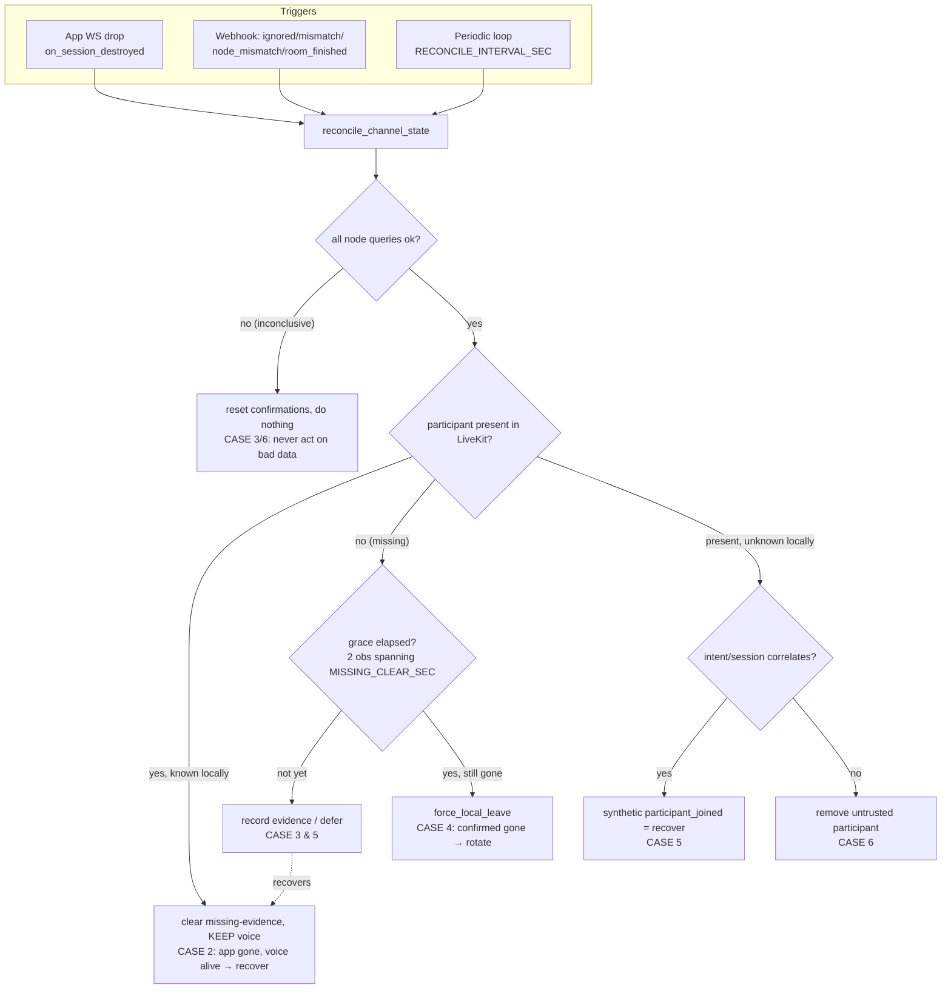
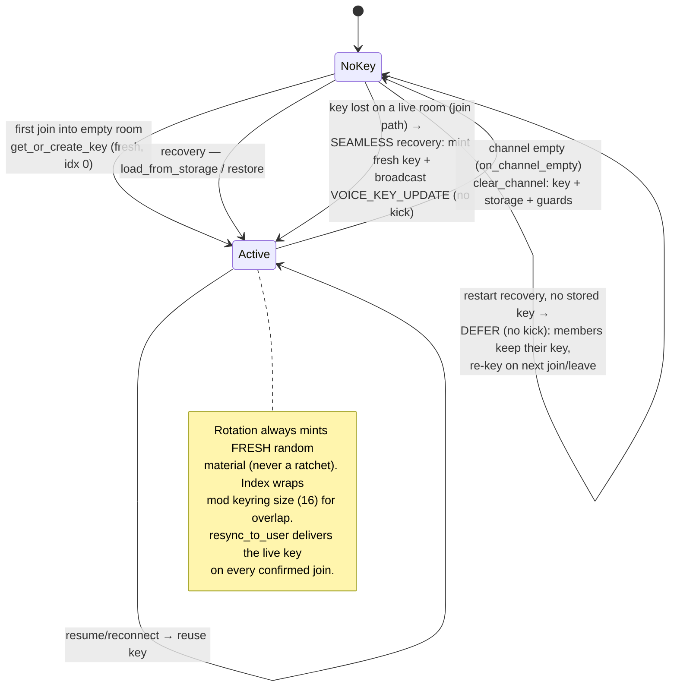

# Voice Subsystem — Flows & Lifecycle

Server-authoritative realtime voice. The C++ backend is the single source of truth for
voice state; LiveKit is the media plane only. Voice ownership is **per-session** (a user may
have multiple app sessions, but only one owns the active voice connection). LiveKit
membership is never trusted as ground truth — webhook events are reconciled against server
state.

Key services: [`VoiceService`](../app/services/voice/VoiceService.cpp),
[`ChannelKeyService`](../app/services/voice/ChannelKeyService.cpp),
[`VoiceSessionManager`](../app/services/voice/VoiceSessionManager.cpp), and the reconcile
evidence tracker. Join is driven by
[`JoinVoiceChannelCommand`](../app/commands/activity/JoinVoiceChannelCommand.cpp).

---

## 1. Voice ownership lifecycle (server-authoritative, per-session)

---

## 2. Join command → token issue (`JoinVoiceChannelCommand` → `join_voice`)

---

## 3. E2EE key acquisition (`acquire_for_join`) — includes the join-rotation debounce

The debounce lives **strictly inside** the `other_members_present` branch, which is only
reached when the user is **not** already a member. Refresh / reconnect / takeover all
short-circuit on `already_member` and never touch it. The debounce only collapses a single
user's repeated join-rotations on the same channel within `VOICE_E2EE_JOIN_ROTATE_DEBOUNCE_SEC`
(default 15s) — i.e. the failed-rejoin storm — and never suppresses a departure rotation.

---

## 4. LiveKit webhook dispatch (`handle_livekit_event`)

---

## 5. `handle_participant_joined` — intent correlation & ownership

---

## 6. `handle_participant_left` — trusted exit vs. switch vs. ignore

---

## 7. Reconcile — the 6 cases

Reconcile is the safety net that keeps server state and LiveKit convergent **without ever
acting on bad data**. It never kicks healthy users and never aggressively cleans up voice on
app-session loss.

| Case | Situation | Action |
|---|---|---|
| 1 | Normal join | Single voice owner per user (set by `handle_participant_joined`) |
| 2 | App gone, voice alive in LiveKit | KEEP voice → recover on reconnect |
| 3 | Inconclusive node queries | Do nothing; never act on bad data |
| 4 | Confirmed gone (trusted left / grace elapsed) | `force_local_leave` + rotate |
| 5 | App + LiveKit both lost then restored | Synthetic `participant_joined` = recover |
| 6 | Present in LiveKit, no correlating intent | Remove untrusted participant |

---

## 8. E2EE key state machine (per channel)

---

## Convergence invariants

- **One key per channel.** `acquire_for_join` returns either the channel's current key or a
  fresh rotation — there is no path that returns per-user-divergent material.
- **Departures always rotate.** `participant_left` / `participant_switch_away` /
  `participant_force_left` rotate directly via `rotate_and_broadcast`, never through
  `acquire_for_join`, so the debounce can never suppress a lock-out rotation.
- **Confirmed joins re-sync.** Every real `participant_joined` calls
  `resync_voice_key_for_user`, delivering the live key under the rotation lock — so a stale
  token key always self-heals.
- **Recovery-first.** App-session loss never removes voice membership; it only requests a
  reconcile. Membership is removed only on a trusted `participant_left` or a grace-confirmed
  reconcile.

## Relevant env vars

| Var | Default | Effect |
|---|---|---|
| `VOICE_E2EE_KEY_TTL_SEC` | 86400 | At-rest key TTL in Redis |
| `VOICE_E2EE_REKEY_GUARD_SEC` | 30 | Window a forced rekey blocks joins |
| `VOICE_E2EE_JOIN_ROTATE_DEBOUNCE_SEC` | 15 | Suppress repeat join-rotations by the same user on a channel |
