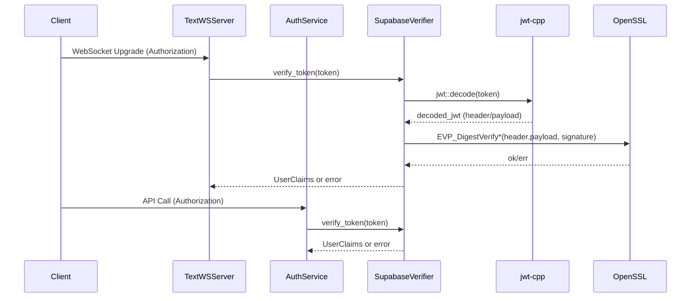

# SupabaseVerifier Report

Scope: backend JWT verification implementation, key handling, and crypto usage. This reflects the current codebase.

## Verification Flow

Entry points:
- WebSocket upgrade auth path: `net/transport/websocket/WebSocketTransport.cpp::TextWSServer::wire`.
- Service auth path: `app/services/auth/AuthService.cpp::AuthService::authenticate`.

Step-by-step flow:
1. On startup, the caller invokes `SupabaseVerifier::create()` and stores the verifier.
2. On each request, `SupabaseVerifier::verify_token()` is called with the raw JWT string.
3. `jwt::decode()` parses the token (base64url decode + JSON parse of header/payload).
4. Header fields (`alg`, optional `kid`) are read from the decoded header.
5. The key is selected by `kid` (if present) or by trying the loaded keys in order.
6. Signature is verified using OpenSSL EVP (ES256) against the `header_b64.payload_b64` signing input.
7. Claims are extracted into `UserClaims`.
8. `nbf` is enforced if present; `exp` is enforced; `iss`/`aud` are enforced if configured.
9. On success, `UserClaims` is returned; otherwise an error is returned.

Code references:
- Verifier creation: `infra/security/token/SupabaseVerifier.cpp::create`.
- Token verification: `infra/security/token/SupabaseVerifier.cpp::verify_token`.
- Claim extraction: `infra/security/token/SupabaseVerifier.cpp::fill_claims` (anonymous namespace).
- WebSocket call site: `net/transport/websocket/WebSocketTransport.cpp::TextWSServer::wire`.
- AuthService call site: `app/services/auth/AuthService.cpp::authenticate`.

## Current Architecture

Key points:
- JWKs are provided via environment variables:
  - `SUPABASE_JWT_CURRENT_KEY` (required)
  - `SUPABASE_JWT_STANDBY_KEY` (optional)
- JWK parsing uses `nlohmann::json` to extract `kty/alg/kid/x/y/crv`.
- Each key is converted to an `EVP_PKEY` once at startup and cached.
- Keys are stored in a `kid -> KeyMaterial` map; lookup is O(1).
- No network calls are made during verification. There is no HTTP fetch or refresh of JWKs.

Thread safety / locking:
- `SupabaseVerifier::verify_token` is `const` and uses no shared mutable state.
- No mutexes or locks in the verifier.

## Hot Path Notes

Per verification call (`SupabaseVerifier::verify_token`):
- `jwt::decode(std::string(token))` performs base64url decoding and JSON parsing.
- Signature verification uses OpenSSL EVP (ES256) without additional key setup.
- Claims are extracted and copied into `UserClaims`.
- `nbf` (if present) and `exp` are enforced, then `iss`/`aud` are enforced when configured.

## Error Mapping (Key Cases)

- Unknown `kid` -> `KeyNotFound`
- `nbf` in the future -> `TokenNotYetValid`
- Issuer mismatch -> `IssuerMismatch`
- Audience mismatch -> `AudienceMismatch`

## Failure Modes (Selected)

| Condition | Expected Error |
|---|---|
| Not yet valid (`nbf` in future) | `TokenNotYetValid` |
| Unknown `kid` | `KeyNotFound` |
| Issuer mismatch | `IssuerMismatch` |
| Audience mismatch | `AudienceMismatch` |

## OpenSSL Usage

OpenSSL is used in two places:
- Startup: building `EVP_PKEY` from JWK `x/y` coordinates.
- Runtime: verifying ES256 signatures via `EVP_DigestVerify*`.

## Key Handling

- Keys are loaded once at startup and never refreshed.
- If `kid` is present in the token header, only the matching key is used.
- If `kid` is absent, the verifier tries the loaded keys in order (current, then standby).
